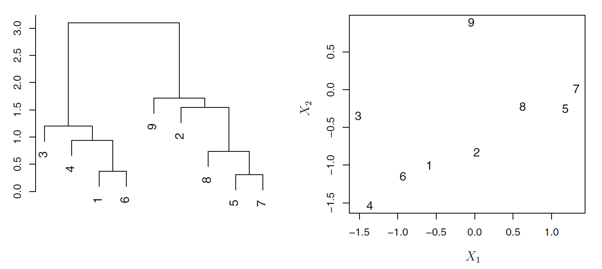

```{r, echo = FALSE}

library(knitr)
opts_chunk$set(tidy.opts=list(width.cutoff=68),tidy=TRUE)
knitr::opts_chunk$set(echo = FALSE,tidy=TRUE,message=FALSE,warning=FALSE,strip.white=TRUE,prompt=FALSE,
                      cache=TRUE, size="scriptsize")

```

```{r}
library(tidyverse)
library(ISLR)
library(ggplot2)
library(GGally)
library(patchwork)
```


---

### PCA example

$~$

* We study the `decathlon2` dataset from the `factoextra` package in R, where Athletes' performance during a sporting meeting was recorded.

* We look at 23 athletes and the results from the 10 disciplines in two competitions.

```{r,eval=T,echo=T}
library(factoextra)
library(FactoMineR)
data("decathlon2")
decathlon2.active <- decathlon2[1:23, 1:10]
names(decathlon2.active) <- c("100m","long_jump","shot_put","high_jump","400m","110.hurdle","discus","pole_vault","javeline","1500m")
```

$~$

\scriptsize
```{r}
decathlon2.active[c(1,3,4),]
```

---

```{r biplot,eval=T,echo=F,fig.width=7,fig.height=7,out.width="55%",fig.cap=""}
r.prcomp <- prcomp(decathlon2.active, scale=T)

biplot(r.prcomp)
```

---


### Proportion of varianced explained (PVE)

$~$

**Recap:** The PVE by PC $m$ is given by

$$
\frac{\sum_{i=1}^m z_{im}^2} {\sum_{j=1}^p\sum_{i=1}^n x_{ij}^2}
$$

---

### Scree plot

$~$

A graphical description of the **proportion of variance explained (PVE)** by a certain number of PCs:

\centering
```{r, out.width="90%"}
p1 = data.frame(PC = 1:10, var = r.prcomp$sdev^2/sum(r.prcomp$sdev^2)) %>% ggplot() + geom_point(aes(PC, var), size = 1.5)+ geom_line(aes(PC, var)) +
  xlab("Principal Component") + ylab("Prop of variance explained")


p2 = data.frame(PC = 1:10, var = cumsum(r.prcomp$sdev^2)/sum(r.prcomp$sdev^2)) %>% ggplot() + geom_point(aes(PC, var), size = 1.5)+ geom_line(aes(PC, var)) +
  xlab("Principal Component") + ylab("Prop of variance explained") + ylim(c(0,1))
 p1 + p2

```

---

# Another example
Protein consumption in twenty-five European countries for nine food groups.

```{r}
library("FactoMineR")
#from MultBiplotR
library(MultBiplotR)

data("Protein")
Protein = Protein[,-c(1,2)]
head(Protein)
Protein = Protein %>% mutate(across(1:9,\(x) scale(x,center =T, scale = T)))

```


---

# Correlation Matrix

```{r}
corr_matrix <- cor(Protein)
ggcorrplot::ggcorrplot(corr_matrix)
```

---

# PCA

```{r}
data.pca <- prcomp(Protein)
biplot(data.pca)
```

---

# Variance Explained
\footnotesize
```{r}
summary(data.pca)
```

---

# Variance Explained - Scree plot


```{r}
p1 = data.frame(PC = 1:9, var = data.pca$sdev^2/sum(data.pca$sdev^2)) %>% ggplot() + geom_point(aes(PC, var), size = 1.5)+ geom_line(aes(PC, var)) +
  xlab("Principal Component") + ylab("Prop of variance explained")


p2 = data.frame(PC = 1:9, var = cumsum(data.pca$sdev^2)/sum(data.pca$sdev^2)) %>% ggplot() + geom_point(aes(PC, var), size = 1.5)+ geom_line(aes(PC, var)) +
  xlab("Principal Component") + ylab("Prop of variance explained") + ylim(c(0,1))
 p1 + p2
```

---

# Clustering

$~$

* The aim is to find _clusters_ or _subgroups_.

* Clustering looks for homogeneous subgroups in the data.


$~$

Difference to PCA?

\pause

$\rightarrow$ PCA looks for low-dimensional representation of the data.

---

### K-means vs. hierarchical clustering

$~$

See menti.com


---

### K-means clustering

$~$

* Fix the number of clusters $K$.

$~$

* Find groups such that the sum of the within-cluster variation is minimized.

$~$


---

# K-means clustering - Algorithm


---


### Hierarchical clustering

$~$

Bottom-up agglomerative clustering that results in a _\textcolor{red}{dendogram}_.

$~$


---

### Important in hierarchical clustering

$~$

* _\textcolor{red}{Linkage:}_ Complete, single, average centroid.

$~$

* _\textcolor{red}{Dissimilarity measure:}_ Euclidian distance, correlation. _Other similarity/distance measures?_ \footnote{ Note: Correlation is actually a similarity measure, not a distance measure. Implication?}


---

### Hierarchical clustering -- example

$~$



Note: The representation on the right is not possible in high-dimensional space (i.e., if we have $X_1, X_2, X_3, ...., X_p$).

---

# Exercise 2 from the book

```{r}

write_matex2 <- function(x) {
  begin <- "\\begin{bmatrix}"
  end <- "\\end{bmatrix}"
  X <-
    apply(x, 1, function(x) {
      paste(
        paste(x, collapse = "&"),
        "\\\\"
      )
    })
  paste(c(begin, X, end), collapse = "")
}

C = matrix(c(0,.3,.4,.7,.3,0,.5,.8,.4,.5,0.,.45,.7,.8,.45,0),4,4)

```

We have the following dissimilarity matrix:

$$`r write_matex2(C)`$$

1. Sketch the dendogram using *complete* linkage, indicate on the plot the height at wich each fusion occurs, as well as the observations corresponding to each leaf in the dendogram

2. Repeat using *single* linkage

3. Suppose we cut the two dendograms such that 2 clusters result. Which observations are in each cluster?

---

# Exercise 11 from the book


---

## Pros and cons of clusterization methods / practical issues

$~$

$~$

$~$

$~$

$~$

$~$

$~$

$~$

$~$

$~$


---

# References