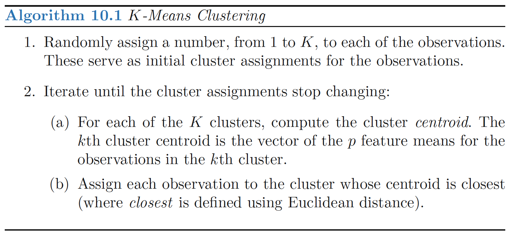

```{r, echo = FALSE}

library(knitr)
opts_chunk$set(tidy.opts=list(width.cutoff=68),tidy=TRUE)
knitr::opts_chunk$set(echo = FALSE,tidy=TRUE,message=FALSE,warning=FALSE,strip.white=TRUE,prompt=FALSE,
                      cache=TRUE, size="scriptsize")

```

```{r}
library(tidyverse)
library(ISLR)
library(ggplot2)
library(GGally)
library(patchwork)
library(ggbiplot)

PCbiplot <- function(PC, x="PC1", y="PC2", colors=c('black', 'black', 'red', 'red')) {
    # PC being a prcomp object
    data <- data.frame(obsnames=row.names(PC$x), PC$x)
    plot <- ggplot(data, aes_string(x=x, y=y)) + geom_text(alpha=.4, size=3, aes(label=obsnames), color=colors[1])
    plot <- plot + geom_hline(yintercept = 0, size=.2) + 
      geom_vline(xintercept  = 0, size=.2, color=colors[2])
    datapc <- data.frame(varnames=rownames(PC$rotation), PC$rotation)
    mult <- min(
        (max(data[,y]) - min(data[,y])/(max(datapc[,y])-min(datapc[,y]))),
        (max(data[,x]) - min(data[,x])/(max(datapc[,x])-min(datapc[,x])))
        )
    datapc <- transform(datapc,
            v1 = .7 * mult * (get(x)),
            v2 = .7 * mult * (get(y))
            )
    plot <- plot + coord_equal() + geom_text(data=datapc, aes(x=v1, y=v2, label=varnames), size = 5, vjust=1, color=colors[3])
    plot <- plot + geom_segment(data=datapc, aes(x=0, y=0, xend=v1, yend=v2), arrow=arrow(length=unit(0.2,"cm")), alpha=0.75, color=colors[4])
    plot
}


```

# PCA - Standardization?


 - Mentimeter

# PCA - Standardization?


<!--here we look at why we want to standardize our data before PCA
-->

```{r, echo = FALSE}
states = row.names(USArrests)
USArrests[1:3,]
```
```{r, echo = TRUE}
apply(USArrests,2,mean)
apply(USArrests,2,var)

# perform PCA
p1 =  prcomp(USArrests, scale = FALSE, center = FALSE)
p2 =  prcomp(USArrests, scale = FALSE, center = TRUE)
p3 =  prcomp(USArrests, scale = TRUE, center = TRUE)
```

# Explained Variance

```{r}
plot1 = data.frame(ncom = 1:4,
           p1 = p1$sdev^2,
           p2 = p2$sdev^2,
           p3 = p3$sdev^2
           ) %>% pivot_longer(-ncom) %>%
  ggplot() + geom_line(aes(ncom, value, group = name,color = name)) +
  ggtitle("Variance of each PC")

plot2 = data.frame(ncom = 1:4,
           p1 = cumsum(p1$sdev^2)/sum(p1$sdev^2),
           p2 = cumsum(p2$sdev^2)/sum(p2$sdev^2),
           p3 = cumsum(p3$sdev^2)/sum(p3$sdev^2)
           ) %>% pivot_longer(-ncom) %>%
  ggplot() + geom_line(aes(ncom, value, group = name,color = name))+
  ggtitle("Variance Explained (%)")

plot1 + plot2

```


# Biplot
```{r, echo=FALSE}

PCbiplot(p1) +
  PCbiplot(p2) +
  PCbiplot(p3)  + plot_layout(ncol = 2)
  


```


---


### PCA example

$~$

* We study the `decathlon2` dataset from the `factoextra` package in R, where Athletes' performance during a sporting meeting was recorded.

* We look at 23 athletes and the results from the 10 disciplines in two competitions.

```{r,eval=T,echo=T}
library(factoextra)
library(FactoMineR)
data("decathlon2")
decathlon2.active <- decathlon2[1:23, 1:10]
names(decathlon2.active) <- c("100m","long_jump","shot_put","high_jump","400m","110.hurdle","discus","pole_vault","javeline","1500m")
```

$~$

\scriptsize
```{r}
decathlon2.active[c(1,3,4),]
```

---

```{r biplot,eval=T,echo=F,fig.width=7,fig.height=7,out.width="55%",fig.cap=""}
r.prcomp <- prcomp(decathlon2.active, scale=T, center = T)

biplot(r.prcomp)
```

---


### Proportion of varianced explained (PVE)

$~$

**Recap:** The PVE by PC $m$ is given by

$$
\frac{\sum_{i=1}^m z_{im}^2} {\sum_{j=1}^p\sum_{i=1}^n x_{ij}^2}
$$

---

### Scree plot

$~$

A graphical description of the **proportion of variance explained (PVE)** by a certain number of PCs:

\centering
```{r, out.width="90%"}
p1 = data.frame(PC = 1:10, var = r.prcomp$sdev^2/sum(r.prcomp$sdev^2)) %>% ggplot() + geom_point(aes(PC, var), size = 1.5)+ geom_line(aes(PC, var)) +
  xlab("Principal Component") + ylab("Prop of variance explained")


p2 = data.frame(PC = 1:10, var = cumsum(r.prcomp$sdev^2)/sum(r.prcomp$sdev^2)) %>% ggplot() + geom_point(aes(PC, var), size = 1.5)+ geom_line(aes(PC, var)) +
  xlab("Principal Component") + ylab("Prop of variance explained") + ylim(c(0,1))
 p1 + p2

```

---

# Another example
Protein consumption in twenty-five European countries for nine food groups.

```{r}
library("FactoMineR")
#from MultBiplotR
library(MultBiplotR)

data("Protein")
Protein = Protein[,-c(1,2)]
head(Protein)
Protein = Protein %>% mutate(across(1:9,\(x) scale(x,center =T, scale = T)))

```


---

# Correlation Matrix

```{r}
corr_matrix <- cor(Protein)
ggcorrplot::ggcorrplot(corr_matrix)
```

---

# PCA

```{r}
data.pca <- prcomp(Protein)
biplot(data.pca)
```

---

# Variance Explained
\footnotesize
```{r}
summary(data.pca)
```

---

# Variance Explained - Scree plot


```{r}
p1 = data.frame(PC = 1:9, var = data.pca$sdev^2/sum(data.pca$sdev^2)) %>% ggplot() + geom_point(aes(PC, var), size = 1.5)+ geom_line(aes(PC, var)) +
  xlab("Principal Component") + ylab("Prop of variance explained")


p2 = data.frame(PC = 1:9, var = cumsum(data.pca$sdev^2)/sum(data.pca$sdev^2)) %>% ggplot() + geom_point(aes(PC, var), size = 1.5)+ geom_line(aes(PC, var)) +
  xlab("Principal Component") + ylab("Prop of variance explained") + ylim(c(0,1))
 p1 + p2
```

---

# Clustering

$~$

* The aim is to find _clusters_ or _subgroups_.

* Clustering looks for homogeneous subgroups in the data.


$~$

Difference to PCA?

\pause

$\rightarrow$ PCA looks for low-dimensional representation of the data.
$\rightarrow$ Clustering aims at creating homogeneous subgroups

---

### K-means vs. hierarchical clustering

$~$

See menti.com


---

### K-means clustering

$~$

* Fix the number of clusters $K$.

$~$

* Find groups such that the sum of the within-cluster variation is minimized.

$~$


---

# K-means clustering - Algorithm




---


### Hierarchical clustering

$~$

Bottom-up agglomerative clustering that results in a _\textcolor{red}{dendogram}_.

$~$


---

# Important in hierarchical clustering

$~$

* _\textcolor{red}{Linkage:}_ Complete, single, average centroid.

$~$

* _\textcolor{red}{Dissimilarity measure:}_ Euclidian distance, correlation. _Other similarity/distance measures?_ \footnote{ Note: Correlation is actually a similarity measure, not a distance measure. Implication?}


---

# Hierarchical clustering -- example

$~$


Note: The representation on the right is not possible in high-dimensional space (i.e., if we have $X_1, X_2, X_3, ...., X_p$).

---


# Nested clusters:

Not always suited for a arbitrary dataset

Group of people

  - evenly split between male and female
  - evenly split between americans, japanese and french
  - best division in two groups -> gender
  -  best division in three groups -> nationality
  - not nested

This explains why hierarchical clusters can sometimes yield worse results than K-means for a given number of clusters

---

# Standardization
```{r}

groceries = data.frame(name = c("Artis", "Baiba",	"Cintija", "Dainis"),
          Caviar_Kg = c(0,0.1,1.0,1.1),
          Bread_Kg = c(10,9,7.5,4.5))


ggplot() + geom_point(data = grocery, aes(Caviar_Kg, Bread_Kg, text = name))


# Reproducibility.
set.seed(1)
# K-means with original variables.
kmeans_orig <- kmeans(groceries[,-1], centers = 2)

```


---

# Exercise 2 from the book

```{r}

write_matex2 <- function(x) {
  begin <- "\\begin{bmatrix}"
  end <- "\\end{bmatrix}"
  X <-
    apply(x, 1, function(x) {
      paste(
        paste(x, collapse = "&"),
        "\\\\"
      )
    })
  paste(c(begin, X, end), collapse = "")
}

C = matrix(c(0,.3,.4,.7,.3,0,.5,.8,.4,.5,0.,.45,.7,.8,.45,0),4,4)

```

We have the following dissimilarity matrix:

$$`r write_matex2(C)`$$

1. Sketch the dendogram using *complete* linkage, indicate on the plot the height at wich each fusion occurs, as well as the observations corresponding to each leaf in the dendogram

2. Repeat using *single* linkage

3. Suppose we cut the two dendograms such that 2 clusters result. Which observations are in each cluster?

---

# Exercise 11 from the book


---

## Pros and cons of clusterization methods / practical issues

$~$

$~$

$~$

$~$

$~$

$~$

$~$

$~$

$~$

$~$


---

# References