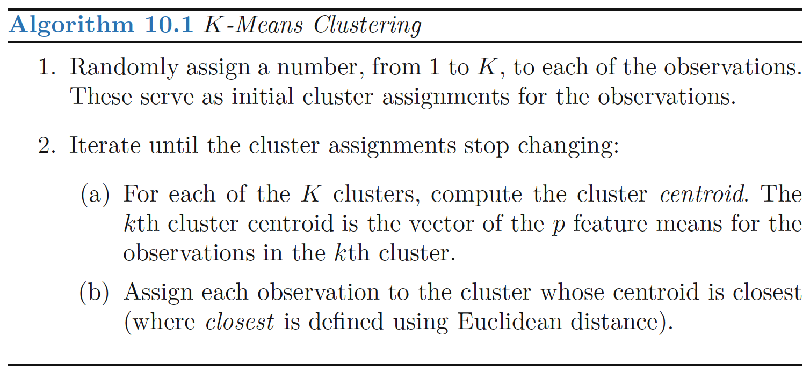
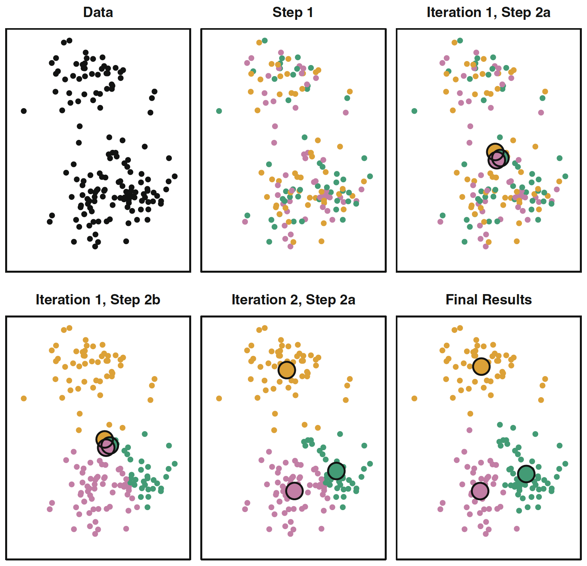
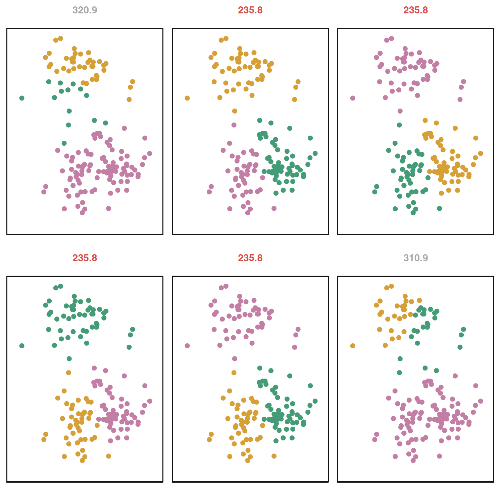
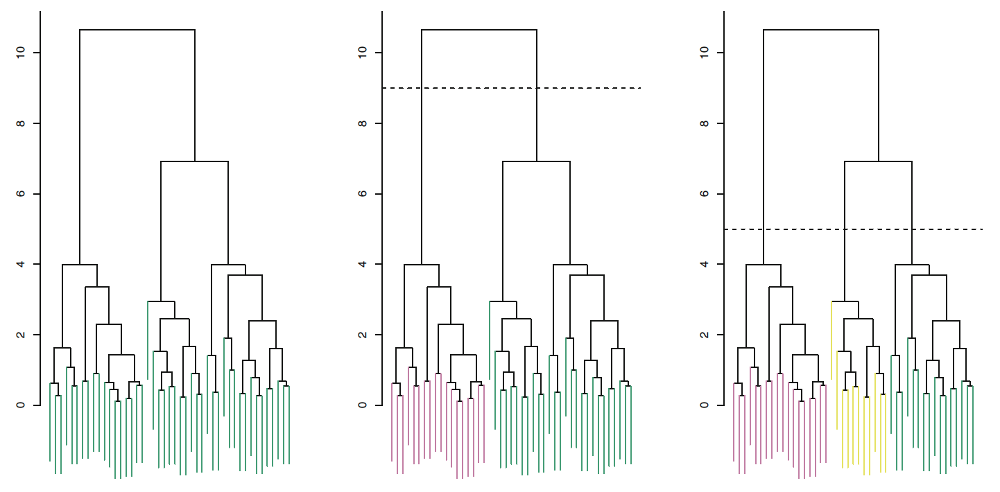
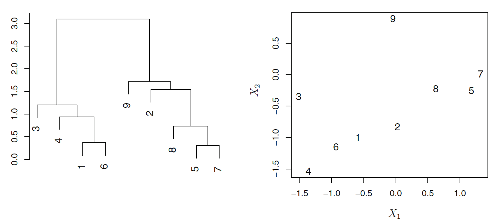
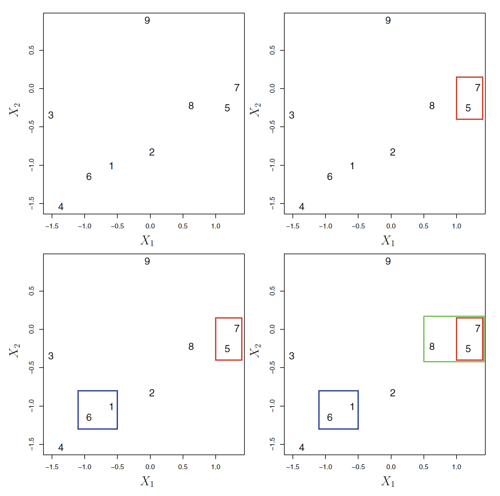
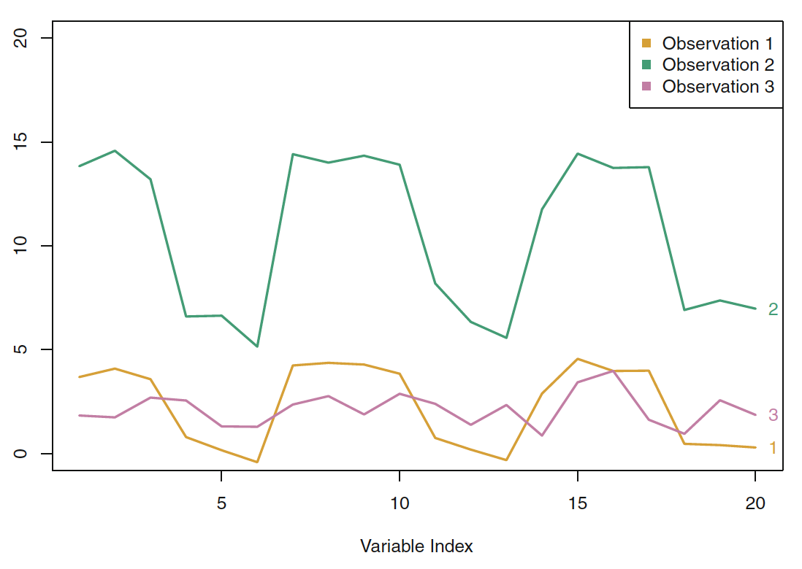
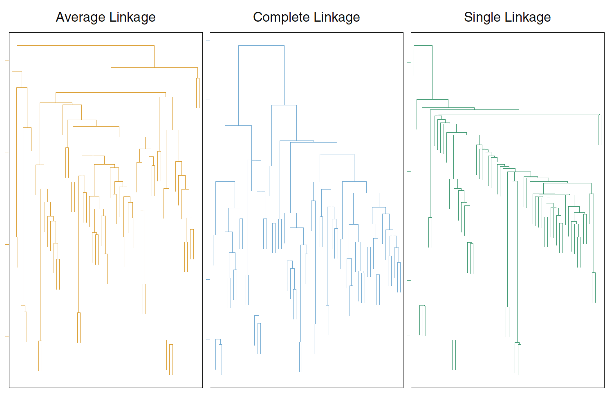
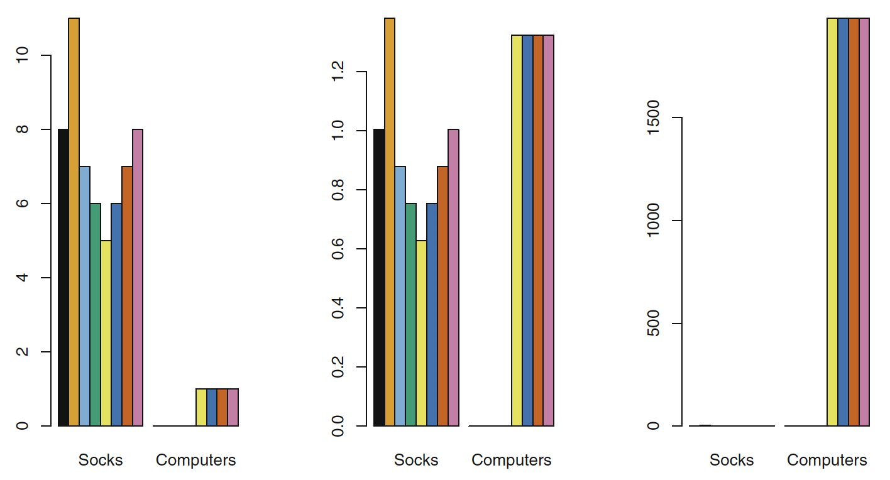

```{r, echo = FALSE}

library(knitr)
opts_chunk$set(tidy.opts=list(width.cutoff=68),tidy=TRUE)
knitr::opts_chunk$set(echo = FALSE,tidy=TRUE,message=FALSE,warning=FALSE,strip.white=TRUE,prompt=FALSE,
                      cache=TRUE, size="scriptsize")

```

```{r}
library(tidyverse)
library(ISLR)
library(ggplot2)
library(GGally)
library(patchwork)
```

# Supervised vs Unsuperviser Learning

- **Supervised Learning**
  
    - For each observation $i = 1,\dots N$ we record:
    
      - $p$ features $X_{i1},\dots,X_{ip}$ AND one response variable $Y_i$
    
    - **Main Interest:**
      
      - Prediction or inference
      
      
- **Unsupervised Learning**
  
   - For each observation $i = 1,\dots N$ we record:
    
      - $p$ features $X_{i1},\dots,X_{ip}$ 
    
   - **Main Interest:**
      
      - Better data visualization, discover interesting patterns, exploratory analysis, clustering
  
# Applications  of Unsupervised Learning (Examples)

- Cancer research: Look for subgroups within the patients or within the genes in
order to better understand the disease

- Online shopping site: Identify groups of shoppers as well as groups of items within each of those shoppers groups.

- Search engine: Search only a subset of the documents in order to find the best one for retrieval.

- +++  
  
# General Challenges of Unsupervised Learning
  
  - In general, unsupervised learning methods are
  
    - more subjective
    - hard to assess results

  - There is usually no obvious ground-truth to compare to

\pause 

  - Remedy: 
  
    - Unsupervised methods are usually part of a bigger goal
    
    - Evaluate them as how they contribute to such bigger goal

  - Examples:
  
    - How clustering shoppers improved your recommendation algorithm?
    - How clustering documents reduced computational complexity and what was the cost involved?
  
# Unsupervised Learning techniques
  
  Covered in this module:
  
  - **PCA (Principal Component Analysis)**

    - Data Visualization

    - Data pre-processing

  - * *Clustering**
    
    - Discovering unknown subgroups in the data
    - 1. k-means clustering
    - 2. Hierarchical clustering

# Data Visualization
```{r, head = TRUE}

data(USArrests)
head(USArrests)
```
Number of arrest per 100 000 inhabitants, Percent of population living in urban areas.


# Data Visualization

```{r, out.width="70%"}
ggpairs(USArrests, title="US Arrests")
```

  - Many plots to look at ($p(p-1)$)
  - Each contains only a small part of the information
  
  We want to find low dimensional representation of the data that captures
most of the info as possible: **Principal Components Analysis (PCA)** is a way to obtain that !


# Principal Components Analisis (I)

- We have a $n \times p$ matrix $X$ (mean centered)

- We want to create a $n \times M$ matrix $Z$, with $M < p$ such that the $m$th column is:

$$Z_m = \sum_{j=1}^{p} \phi_{jm} X_j \quad \text{subject to} \quad \sum_{j=1}^p \phi_{jm}^2 = 1$$
  
    - Why do we have the constrain $\sum_{j=1}^p \phi_{jm}^2 = 1$ ?

# The first principal component $Z_1$ 

  - We look for linear combinations of the form 
  
$$z_{i1} = \sum_{j = 1}^p\phi_{j1}x_{ij} = \phi_{11}x_{i1} + \phi_{21}x_{i1} +\dots+\phi_{p1}x_{ip} $$
  that have largest variance subject to $\sum|\phi_{j1}^2| = 1$
  
  - The sample variance of $z_1$ is $\frac{1}{n}\sum_i z_{i1}^2 =  \frac{1}{n}\sum_i \left(\sum_{j = 1}^p\phi_{j1}x_{ij}\right)^2$

# The first principal component $Z_1$  - Maximization problem

We want to find

$$\text{max}_{\phi_{11},\dots,\phi_{p1}}(\text{Var}(z_1)) = \text{max}_{\phi_{11},\dots,\phi_{p1}}\left(\frac{1}{n}\sum_i \left(\sum_{j = 1}^p\phi_{j1}x_{ij}\right)^2\right)  $$
given $\sum|\phi_{j1}^2| = 1$

- This is a standard problem in linear algebra solved via singular-value decomposition of $\mathbf{X}$


# The first principal component $Z_1$  - Geometric interpretation

  - The loading vector $\phi_1 = (\phi_{11},\dots,\phi_{p1})$ defines the direction along with the data vary most
  
  
```{r, out.width="60%"}
data = USArrests[,c(1,2)]
datas = scale(data)
results <- prcomp(datas, scale = FALSE)

a11 = results$rotation[1,1]
a12= results$rotation[2,1]
c1 = -a11/a12
a21 = results$rotation[1,2]
a22= results$rotation[2,2]
c2 =-a21/a22


u = datas[,2] + 1/c2 * datas[,1]
y1 = (1+c2^(-2))^(-1) *u
x1 = 1/c2*y1
data.frame(datas) %>%
  mutate(pr1 = x1, pr2 = y1) %>%
  ggplot() + geom_point(aes(Murder, Assault)) +
  coord_equal() +
 # geom_abline(intercept = 0, slope = c1, color = "green") +
  geom_abline(intercept = 0, slope = c2, color = "red") +
  geom_point( aes(pr1,pr2, color = "PC1")) +
  geom_segment(aes(x = Murder, xend = pr1, y = Assault, yend = pr2), color = "grey", linetype = "dashed") 
```


# The second principal component $Z_2$ 

  
  - Once we have $Z_1$: 
  
  - $Z_2$ should be uncorrelated to $Z_1$, and have the highest variance, subject to this constrain.
    
    - The direction of $Z_1$ must be perpendicular (or orthogonal) to the direction of $Z_2$
  
  - And so on ...

\vspace{1cm}

- We can construct up to $p$ PCs that way.
- In which case we have: 
  
  - Captured all the variability contained in the data

  - Created a set of orthogonal predictors
  - But  **not** accomplished dimensionality reduction

# Example 1

```{r, out.width="70%"}
data = USArrests[,c(1,2)]
datas = scale(data)
results <- prcomp(datas, scale = FALSE)

a11 = results$rotation[1,1]
a12= results$rotation[2,1]
c1 = -a11/a12
a21 = results$rotation[1,2]
a22= results$rotation[2,2]
c2 =-a21/a22


u = datas[,2] + 1/c2 * datas[,1]
y1 = (1+c2^(-2))^(-1) *u
x1 = 1/c2*y1
data.frame(datas) %>%
  mutate(pr1 = x1, pr2 = y1) %>%
  ggplot() + geom_point(aes(Murder, Assault)) +
  coord_equal() +
  geom_abline(intercept = 0, slope = c1, color = "green") +
  geom_abline(intercept = 0, slope = c2, color = "red") +
  geom_point( aes(pr1,pr2, color = "PC1")) +
  geom_segment(aes(x = Murder, xend = pr1, y = Assault, yend = pr2), color = "grey", linetype = "dashed") 
```

# Example 2

```{r}
results <- prcomp(USArrests, scale = TRUE)
print("Loadings")
results$rotation
```
# Example 2
```{r, out.width="80%"}
biplot(results, scale = 0)
```

# PCA - General setup
  
  - Let $\boldsymbol X$ be a (standardized) matrix with dimension $n \times p$.

  - Assume $\boldsymbol \Sigma$ to be the covariance matrix associated with $\boldsymbol X$.

  -  $\Sigma$ is  non-negative, therefore:
$$ \boldsymbol {\Sigma} = \boldsymbol C \boldsymbol \Lambda \boldsymbol C^{-1} $$
  
  - $\boldsymbol \Lambda = diag(\lambda _1, ..., \lambda _p)$ is a diagonal matrix of ordered eigenvalues
    
  - $\boldsymbol C$ is a matrix of eigenvectors of $\boldsymbol {\Sigma}$.


- We want $\boldsymbol Z_1 = \boldsymbol \phi_1 \boldsymbol X$, subject to $||\boldsymbol \phi_1||_2 = 1$ so that the variance  $V(\boldsymbol Z_1) = \boldsymbol \phi_1^T \Sigma \boldsymbol \phi_1$ is maximised
  
  - $\boldsymbol \phi_1$ is the eigenvector corresponding to the largest eigenvalue of $\boldsymbol \Sigma$
  
  - The fraction of the original variance kept by the first $M$ principal component

$$ R^2 = \frac{\sum _{i=1}^{M} \lambda _i}{\sum _{j=1}^{p}\lambda _j} $$

# Example 2

```{r, out.width="80%"}
p1 = data.frame(PC = c(1:4),
           Var = results$sdev^2 ) %>%
  ggplot() + geom_point(aes(PC, Var)) +
  geom_line(aes(PC, Var)) +
  ggtitle("Variance Explained by each PC")

p2 = data.frame(PC = c(1:4),
           Var = results$sdev^2 ) %>%
  mutate(cum= cumsum(Var)/sum(Var)) %>%
  ggplot() + geom_point(aes(PC, cum)) + 
  geom_line(aes(PC, cum)) + 
  
  ggtitle("Variance Explained by each PC") +
  ylab("Proportion of variance explained") +
  xlab("Principal Component")

p1 + p2
```

# Notes about PCA

  - PCA is dependent on the scaling of the variables involved....why?
  
  - Each Principal Component loading vector is unique, up to a sign flip.
  
  - Flipping the sign has no effect as the direction of the PC does not change.

# Clustering methods


- **Goal**: Partition the data into different groups
    - Observations within each group are quite similar
    - Observations in different groups are quite different 
    
- Must define what it means to be similar or different
    - Domain specific considerations
    
- Examples:
    - Different types of cancer
    - Market segmentation
    - Search Engine

# PCA vs. Clustering methods

- Both aim to simplify the data via small number of summaries

- PCA looks for a low-dim representation that explains good fraction of variance
    - Principal Components

- Clustering looks for homogeneous subgroups among the observations
    - Clusters

# Types of clustering

- K-means

- hierarchical clustering

# K-means clustering


- It is an approach for *partitioning* a dataset into K distinct, non-overlapping clusters.

- $C_1, ..., C_k$: Sets containing indices of observations in each cluster.

- This sets satisfy two properties:
    - $C_1 \cup C_2 \cup \ldots \cup C_k = \{1,\ldots,n\}$
    - $C_k \cap C_{k'} = \emptyset \text{ for all }k\neq k'$


  1.  Each observation belongs to  one of the $K$ clusters.

  2.  No observation belongs to more than one cluster.


# Within-cluster variation

- A good cluster is one for which the **within-cluster variation** is **as small as possible**

- Within-cluster variation (squared Euclidean distance)

$$W(C_k) = \frac{1}{|C_k|} \sum_{i, i' \in C_k} \sum_{j=1}^{p}(x_{ij} - x_{i'j})^2$$

- As small as possible

$$\underset{C_1, \ldots, C_k}{\text{minimize}}\left\{\sum_{k=1}^{K}W(C_k)\right\}$$


- Squared Euclidean distance is the most common


# K-means algorithm

- Find algorithm to solve:

$$\underset{C_1, \ldots, C_k}{\text{minimize}}\left\{\sum_{k=1}^{K} \frac{1}{|C_k|} \sum_{i, i' \in C_k} \sum_{j=1}^{p}(x_{ij} - x_{i'j})^2 \right\}$$

- Difficult problem: $K^n$ ways to partition $n$ observations into $K$ clusters.

- Fortunately, there is a simple algorithm that can provide a local optimum

# K-means algorithm


<!-- # Recommended Exercise 2 -->

<!-- Show that the algorithm in the previous slide is guaranteed to decrease the value of the objective -->

<!-- $$\underset{C_1, \ldots, C_k}{\text{minimize}}\left\{\sum_{k=1}^{K} \frac{1}{|C_k|} \sum_{i, i' \in C_k} \sum_{j=1}^{p}(x_{ij} - x_{i'j})^2 \right\}$$ -->

<!-- at each step.  -->


# K-means algorithm

{width=50%}

- A simulated data set with 150 observations in two-dimensional space. 

- K = 3

- Final result is obtained after 10 iterations


# K-means algorithm (stating conditions)


{width=60%}


- K-means performed six times with random initial conditions

- K = 3

- Above is the value of objective function


# K-means algorithm

- Potential disadvantage of K-means, we need to select $K$

- This is not always a disadvantage


# Hierarchical Clustering


- Does not require us to commit to a particular choice of $K$ in advance

- Produces an attractive tree-based representation called *dendogram*

- We will describe bottom-up or agglomerative clustering
    - Most common type of hierarchical clustering


- Other approach available is called Divisive or "top down" approach


# Interpreting a dendogram



- The height of the cut in the dendogram serves the same role as $K$ in $K$-means clustering
    - Not always clear where to make the cut
    
- Clusters obtained by cutting the vertical axis at a lower level are always nested within clusters obtained by cutting at a higher level.


# Dendograms can be misleading




- The lower in the tree fusions occur -> more similar

- The height of the fusion, as measured on the vertical axis, indicates how different the two observations are.
    - We should not draw conclusions based on the horizontal axis    
    
- It is tempting but incorrect to conclude that observations 9 and 2 are quite similar to each other.
    - observation 9 is no more similar to observation 2 than it is to observations 8, 5, and 7.


# Hierarchical structure

- Not always suited for a arbitrary dataset

- Group of people 
    - evenly split between male and female 
    - evenly split between americans, japanese and french
    - best division in two groups -> gender
    - best division in three groups -> nationality
    - not nested

- This explains why hierarchical clusters can sometimes yield worse results than K-means for a given number of clusters

# The hierarchical clustering algorithm

1. Start at the botton of the dendogram
    - Each of the $n$ observations is treated as its own cluster
2. Fuse the two clusters that are more similar to each other
    - There are now $n-1$ clusters
3. Repeat step 2 until there are only one cluster


- Dissimilarity measure
    - We need to chose a dissimilarity measure

- Linkage
    - Extend the concept of dissimilarity from a pair of observation to a pair of groups of observations


# The hierarchical clustering algorithm

{width=50%}

- First few steps of the hierarchical clustering algorithm
    - Euclidean distance
    - Complete linkage

- 5 and 7

- 6 and 1

- 8 and {5, 7} using complete linkage


# Choice of dissimilarity measure

- Euclidean distance is most common dissimilarity measure to use.

- But there are other options

- Correlation-based distance
    - Correlation focus on shape of the observation profile rather than their magnitude


- Correlation-based distance: 
    - Two observations are similar if their features are highly correlated
    - Even though observed values might be far apart according to Euclidean distance


# Correlation-based distance

\centering
{width=50%}

- Three observations with measure on 20 variables

- Observations 1 and 3
    - close to each other in Euclidean distance
    - weakly correlated -> large correlation-based distance
    
- Observations 1 and 2
    - Different values for each variable -> large euclidean distance
    - Strongly correlated


# Online retailer example

- Online retailer example
    - Identify subgroups of similar shoppers
    - Matrix with shoppers (rows) and items (columns)
    - Value indicate number of times a shopper bought an item
    
- Euclidean distance
    - Infrequent shoppers will be clustered together
    - The amount of itens bought matters
    
- Correlation distance
    - Shoppers with similar preference will be clustered together
    - Including both high and low volumes shoppers

# Linkage

- Need to extend the concept between dissimilarity between pairs of observations to pairs of groups of observations

- Linkages
    - Complete: Maximal intercluster dissimilarity
    - Single: Minimal intercluster dissimilarity
    - Average: Mean intercluster dissimilarity


- Compute all pairwise dissimilarities between the observations in cluster A and the observations in cluster B. 

- Then apply the appropriate function to compute either Complete, Single and Average linkage


# Linkage

- Dendogram depends strongly on the type of linkage used 

{width=60%}


- Average and complete linkage tend to yield more balanced clusters.

# Scaling variable

- Usually wise to scale the variables

{width=70%}


- Eight online shoppers (each with one color)

- (Left) Number of pairs of socks, and computers -> Socks will dominate

- (Center) Number of itens, scaled -> The weight of computer increase

- (Right) Number of dollar spent -> Computers will dominate

- Which case is better depend on the application and objectives


# Summary of the decisions involved

- Should standardize the variables?
    - Usually yes

- K-means clustering
    - What K?

- Hierarchical clustering:
    - dissimilarity measure?
    - Linkage?
    - Where to cut the dendogram?

- With these methods, there is no single right answer—any solution that exposes some 
interesting aspects of the data should be considered.

# Extra slides

- Blog post applying k-means clustering on data from Twitter
    - http://thinktostart.com/cluster-twitter-data-with-r-and-k-means/
    
- Blog post applying hierarchical clustering on data based on the complete works of william shakespeare
    - https://www.r-bloggers.com/clustering-the-words-of-william-shakespeare/ 
