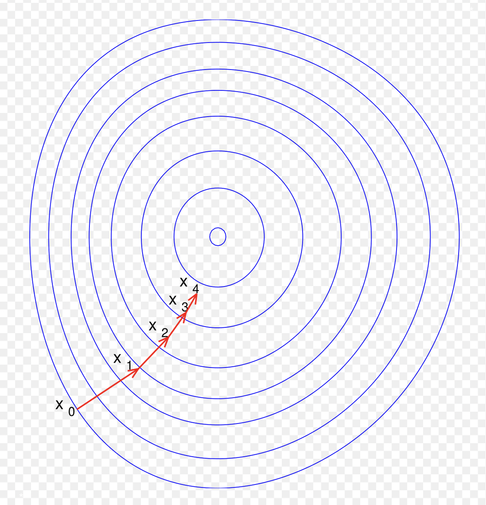
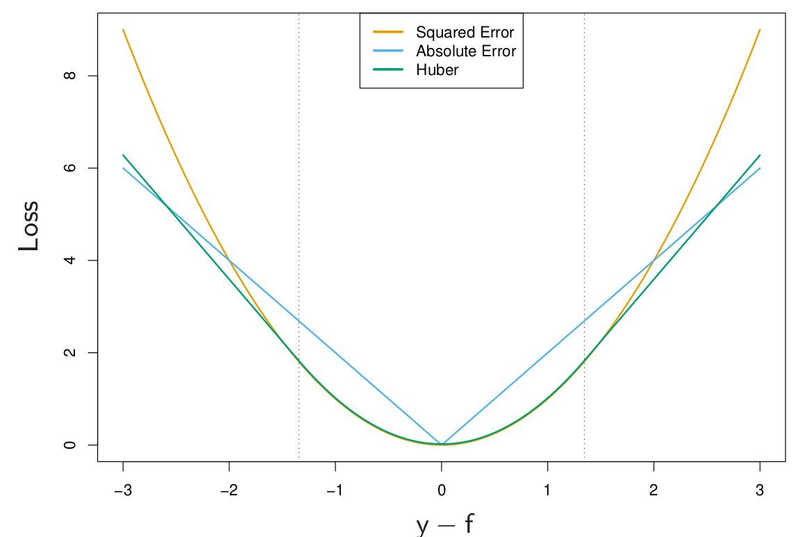

```{r setup, include=FALSE}
showsol<-TRUE
library(knitr)
opts_chunk$set(tidy.opts=list(width.cutoff=68),tidy=TRUE)
knitr::opts_chunk$set(echo = TRUE,tidy=TRUE,message=FALSE,warning=FALSE,strip.white=TRUE,prompt=FALSE,
                      cache=TRUE, size="scriptsize")
whichformat="latex"
```


---

## Learning material for this module

$~$

* @ISL2: Section 8.2.3 (Boosting)

\vspace{2mm}

* @hastie_etal2009: The Elements of Statistical Learning, Chapter 10

\vspace{8mm}

<!-- Check out:  -->

<!-- * https://arogozhnikov.github.io/2016/04/28/demonstrations-for-ml-courses.html -->

In addition, some material we use is from the book by @boehmke_greenwell2020

\vspace{2mm}

* https://bradleyboehmke.github.io/HOML/gbm.html
 
 

<!-- https://arogozhnikov.github.io/2016/06/24/gradient_boosting_explained.html  -->

 
---

## What will you learn?

$~$

* Boosting methods -- general terms


\vspace{2mm}

* AdaBoost

\vspace{2mm}

* Gradient boosting

\vspace{2mm}

* Stochastic gradient boosting

\vspace{2mm}

* XGBoost: eXtreme Gradient Boosting

\vspace{2mm}

* Outlook to modern methods: Light GBM, catboost, ngboost

\vspace{2mm}

* Boosting of linear models (experience from a master student)

---

## Boosting methods

$~$

* "Boosting" is one of the most powerful learning ideas that is currently around.

\vspace{2mm}

* First ideas in the 1990s and early 2000s (_e.g._, @freund1997decision, @ridgeway1999state, @friedman2000additive)

\vspace{2mm}

* Boosting is a general method for building an ensemble out of simpler models.

\vspace{2mm}

* Boosting is usually applied to models with high bias and low variance, usually in the context of boosted regression and classification trees.

\vspace{2mm}

* It is also possible to boost, \emph{e.g.}, linear or penalized regression models.


---


## Boosted trees vs deep learning (neural networks) 

$~$

* Boosted trees and neural networks (deep learning) are currently the most powerful competitors in statistical learning.

$~$

* Kaggle is a website where you find open competitions -- many of them are won by tree-based methods. 

$~$

* Maybe you will earn a living from this in the future...? See here:  
https://www.kaggle.com/competitions


---

## Examples (recent literature)

\centering

{width=70%}

$~$

\flushleft

From the abstract:

{width=80%}

---


See here to access the paper:

https://hal.science/hal-03723551v2


---
 
## Recap: Trees and random forests
 
$~$

* See Module 8: Regression and classification trees.

\vspace{2mm}

* Trees are simple, but not very good in predicting.

\vspace{2mm}

* Improvements via bagging and random forests. 

\vspace{2mm}

* Bagging: Build trees on bagged datasets and average over predictions.

\vspace{2mm}

* Random forests: Same as bagging, but only use a subset of all variables for each new split. Regression: $p/3$, classification $\sqrt{p}$ of all variables. 

\vspace{2mm}


* Loss of interpretability is compensated by variable importance measures. 


---

## Motivation for Boosting in the context of trees

$~$


* Question: Could we address the shortcomings of single decision trees models in some other way than by using random forests?

$~$

* For example, rather than performing variance reduction on complex trees, can we decrease the bias by only using simple trees?

$~$

* A solution to this problem, making a good model from simple trees, is another class of ensemble methods called _boosting_.

$~$

_\textcolor{red}{Boosting}_ is the process of iteratively adding basis functions in a greedy fashion so that each additional basis function further reduces the selected loss function.

---

## Simple example 1: Boosting for a classification problem: AdaBoost
\tiny 
Chapter 10.1 in @hastie_etal2009, including Fig 10.1 and Algorithm 10.1

\normalsize

$~$

* Assume we have a binary classification problem for $Y\in \{-1,1\}$, a vector of predictor variables $X$, and a classifier $G(X)$. 

\vspace{2mm}

* The error rate for a given training sample is then 
$$\text{err} =\frac{1}{N} \sum_{i=1}^N I(y_i \neq G(x_i)) \ .$$

\vspace{2mm}

* Here, $G(X)$ is assumed to be a _\textcolor{red}{weak classifier}_, that is, its error rate is only _slightly better than a random guess_.

\vspace{2mm}


* $G(X)$ can for example be a tree which is only a "stump". But it can also be any other classifier.

---


\vspace{2mm}

* How would such a weak classifier ever give good predictions?

\vspace{2mm}

* Idea: 
    * Sequentially apply the weak classifier on _modified versions_ of the data, producing a _sequence_ $G_m(x)$ of weak classifiers for $m=1,2,\ldots,M$. 
    * At the end, use a weighted sum $G(x)=\text{sign}\left( \sum_{m=1}^M \alpha_m G_m(x)\right)$ to make the final prediction.


\centering
{width=50%}

\tiny
(Taken from @hastie_etal2009 )

---

\vspace{2mm}

How do we then find the sequence $G_m(x)$ and the corresponding weights $\alpha_m$?


---

**Algorithm 10.1 (@hastie_etal2009): AdaBosot.M1**

$~$

1. Initialize the observation weights $w_i= 1/N$, $i=1,2,\ldots, N$.

\vspace{2mm}

2. For $m=1,2,...,M$:  
    a) Fit a classifier $G_m(x)$ to the training data using weights $w_i$.
    b) Compute
    $$\text{err}_m = \frac{\sum_{i=1}^N w_i I(y_i\neq G_m(x_i))}{\sum_{i=1}^N w_i} \ .$$
    c) Compute $\alpha_m = \log((1-\text{err}_m)/\text{err}_m)$.
    d) Set $w_i \leftarrow w_i \cdot \exp(\alpha_m \cdot I(y_i\neq G_m(x_i)),$ $i=1,2,\ldots, N$.

\vspace{2mm}

3. Output $G(x) = \text{sign}\left[\sum_{m=1}^M \alpha_m G_m(x)\right]$.  


---

Explanations:  

$~$
 
 * Weights $\alpha_m$: assigns larger overall weight to good classifiers\footnote{Note: When $\text{err}_m<0.5$, then $\alpha_m>0$. Otherwise, the classifier needs to be inverted and $\alpha_m<0$ makes sense.}.
 
 * Weights $w_i$ modify the original data. This ensures that observations $i$ with wrong classification in $G_{m-1}(x)$ obtain larger weights, namely 
 \begin{align*} 
 w_i &\leftarrow w_i \cdot \exp(\alpha_m) \ , &\text{ if } y_i \neq G(x_i) \ , \\
 w_i &\leftarrow w_i \ , &\text{ if } y_i = G(x_i) \ .
 \end{align*}
 
 * The sum $\sum_{m=1}^M \alpha_m G_m(x)$ is a continuous number, so we take its sign to get a classification into -1 or 1. 
 
---

## Example

$~$

Inspired by (10.2) in the Elements book:

\vspace{2mm}

* Generate features $X_1, \ldots, X_{10}$ multivariate Gaussian.
* Classify $y=1$ if $\sum_{j=1}^{10}X_j^2 > 9.34$, $y=-1$ otherwise.
* 1000 training and 4000 test observations.

$~$

Yields roughly half/half of each category:

$~$

\scriptsize
\centering
```{r,echo=TRUE,fig.width=6,fig.height=5,out.width="40%"}
library(mvtnorm)
set.seed(123)
X <- rmvnorm(5000,rep(0,10))
y <- ifelse(rowSums(X^2)>9.34,1,-1)
hist(y,title="")
```

---

Fit AdaBoost on the training data using the function `ada()` from the `ada` R package. The function uses classification trees as weak learners. We use default choice for tree depth (tree depth is decided on a case-by-case basis):

\vspace{2mm}

\scriptsize
\centering

```{r,echo=TRUE,fig.width=6,fig.height=5,out.width="50%"}
library(ada)
dd <- data.frame(X,y)
dd.train <- dd[1:1000,]
dd.test <- dd[1001:5000,]

set.seed(4268)
r.ada <- ada(y~.,dd.train,iter=400,type="discrete", loss="ada", control=rpart.control())
plot(r.ada)
```

 


---

### Error rates: AdaBoost vs random forest

$~$

AdaBoost test error: 

\vspace{2mm}

\scriptsize
```{r}
ada.pred <- predict(r.ada,dd.test)
sum(dd.test$y!=ada.pred)/4000
```

$~$

$~$

\normalsize
Random forest test error:

\vspace{2mm}

\scriptsize
```{r}
library(randomForest)
set.seed(123)
rf.boston=randomForest(as.factor(y)~.,dd.train,mtry=3,
                       ntree=1000)
rf.pred <- predict(rf.boston,newdata=dd.test)
sum(dd.test$y!=rf.pred)/4000
```

---

# Simple example 2: Boosting regression trees 

<!-- _Boosting_ is an alternative approach for improving the predictions resulting from a decision tree.  -->
<!-- We will only consider the description of boosting regression trees (and not classification trees) in this course. -->

$~$

In tree boosting, trees are grown _sequentially_ so that each tree is grown using information from the previous tree. 

\vspace{2mm}

1. Build a decision tree with $d$ splits (and $d+1$ terminal notes).
2. Improve the model in areas where the model didn't perform well. This is done by fitting a decision tree to the _residuals of the model_. This procedure is called _learning slowly_. 
3. The first decision tree is then updated based on the residual tree, but with a weight. 

The procedure is repeated until some stopping criterion is reached. Each of the trees can be very small, with just a few terminal nodes (or just one split).

---

**Algorithm 8.2: Boosting for regression trees**

\vspace{2mm}


1. Set $\hat{f}(x) = 0$ and $r_i = y_i$ for all $i$ in the training set.
2. For $b=1,2,...,B$, repeat:  
    a) Fit a tree $\hat{f}^b$ with $d$ splits ($d+1$ terminal nodes) to the training data $(X,r)$.  
    b) Update $\hat{f}$ by adding in a shrunken version of the new tree: $$\hat{f}(x) \leftarrow \hat{f}(x)+\nu \hat{f}^b(x).$$  
    c) Update the residuals, $$r_i \leftarrow r_i - \nu \hat{f}^b(x_i).$$  
3. The boosted model is $\hat{f}(x) = \sum_{b=1}^B \nu \hat{f}^b(x).$

\vspace{4mm}

Boosting has three tuning parameters which need to be set ($B$, $\nu$, $d$), and can be found using cross-validation.

---

**Tuning parameters**

\vspace{2mm}

* **Number of trees $B$**. Could be chosen using cross-validation. A too small value of $B$ would imply that much information is unused (remember that boosting is a slow learner), whereas a too large value of $B$ may lead to overfitting. 

\vspace{1mm}

* **Shrinkage parameter $\nu$**. Controls the rate at which boosting learns. $\nu$ scales the new information from the $b$-th tree, when added to the existing tree $\hat{f}$. A small value for $\nu$ ensures that the algorithm learns slowly, but will require a larger $B$. Typical values of $\nu$ is 0.1 or 0.01.

\vspace{1mm}

* **Interaction depth $d$**: The number of splits in each tree. This parameter controls the complexity of the boosted tree ensemble (level of interaction between variables). By choosing $d=1$ a tree stump will be fitted at each step and this gives an additive model.


---

A very simple illustration of this idea can be found here:

https://arogozhnikov.github.io/2016/06/24/gradient_boosting_explained.html 


---

## Revisit the Boston data from module 8

$~$

We are now finally boosting the Boston trees! We use the `gbm()` function from the respective R package. We boost with 5000 trees and allow the interaction depth (number of splits per tree) to be of degree 4:

\vspace{2mm}

\scriptsize

```{r,echo=FALSE}
library(MASS)
set.seed(1)
train = sample(1:nrow(Boston), nrow(Boston)/2)
boston.test=Boston[-train,"medv"]
```

```{r}
library(gbm)
set.seed(1)
boost.boston=gbm(medv~.,data=Boston[train,],
                 distribution="gaussian",
                 n.trees=5000,interaction.depth=4)
summary(boost.boston,plotit=FALSE)
```

---
 
**Prediction on the test set**

* Calculate the MSE on the test set, first for the model with $\nu=0.001$ (default), then with $\nu=0.2$.

* Ideally, we should do a cross-validation to find the best $\nu$ over a grid (comes later), but here it seems not to make a big difference.

$~$

\scriptsize

```{r}
yhat.boost=predict(boost.boston,newdata=Boston[-train,],n.trees=5000)
mean((yhat.boost-boston.test)^2)
```

\vspace{2mm}

```{r}
boost.boston=gbm(medv~.,data=Boston[train,],distribution="gaussian",
                 n.trees=5000,interaction.depth=4,shrinkage=0.2,verbose=F)
yhat.boost=predict(boost.boston,newdata=Boston[-train,],n.trees=5000)
mean((yhat.boost-boston.test)^2)
```


<!-- --- -->

<!-- \scriptsize -->

<!-- ```{r boston8, echo=TRUE, fig.width=5, fig.height=4,fig.align = "center",out.width='60%'} -->
<!-- plot(yhat.boost,boston.test,pch=20) -->
<!-- abline(0,1) -->
<!-- ``` -->


---

# Boosting more generally


$~$

* AdaBoost.M1 and the above regression tree example are both relatively simple special cases of (tree) boosting. 

\vspace{2mm}

* We therefore step a bit back and look at boosting methods in more generality.

\vspace{2mm}

* In general terms, we are looking for expansions that take the form
$$f(x) = \sum_{m=1}^M \beta_m b(x;\gamma) \ , $$
where $b(x;\gamma)$ are (simple) _basis functions_ in $x$ characterized by a set of parameters $\gamma$, and $\beta_m$ are the corresponding expansion coefficients. 

\vspace{2mm}

* In the following, we focus on the case where the $b(x;\gamma)$ correspond to trees.


---

## Boosting trees -- what do we want to minimize?

$~$ 

Start by looking again at _a single tree_. We need to find regions $R_j$ and values $f(x)=\gamma_j$ if $x\in R_j$, for $j=1,2,\ldots,J$. The tree can then be expressed as 

\begin{equation*} 
T(x;\Theta) = \sum_{j=1}^J \gamma_j I(x\in R_j) \ ,
\end{equation*}

with parameters $\Theta=\{R_j,\gamma_j\}_1^J$. 
For a given numbers of   regions J, we want to minimize

\begin{equation}\label{eq:treeopt}
\hat\Theta = \arg \min_\Theta \sum_{j=1}^J \sum_{x_i \in R_j} L(y_i,\gamma_i) \ , 
%\hat\Theta = \arg \min_\Theta \sum_{i=1}^N L(y_i,T(x_i;\Theta) ) \ , 
\end{equation}
for a set of observations $(x_i,y_i)$ $(i=1,\ldots,N)$ and for loss function $L()$, for example squared-error, Gini, deviance loss etc. 

---

\label{sl:regions}

The optimization problem can thus be split into two parts:

$~$

1) **Find $\gamma_j$ given $R_j$**: Given $R_j$, estimating $\gamma_j$ is easy. Often it is $\gamma_j=\overline{y_j}$ or a majority vote for classification.

\vspace{2mm}

2) **Finding the regions $R_j$**: This is the hard part. Usually approximated via a greedy algorithm. Often, use smoother approximations of the optimization criterion 
\begin{equation}\label{eq:approx}
\tilde\Theta = \arg \min_\Theta \sum_{j=1}^J \sum_{x_i \in \tilde{R}_j} \tilde{L}(y_i,T(x_i,\Theta)) \ , 
\end{equation}
and then use $\hat{R}_j=\tilde{R}_j$ to find $\gamma_j$ using criterion \eqref{eq:treeopt}.

<!-- \begin{equation*}  -->
<!-- \hat\Theta = \arg \min_\Theta \sum_{j=1}^J \sum_{x_i \in R_j} L(y_i,\gamma_i) \ . -->
<!-- \end{equation*} -->


---

## From single trees to boosting

\label{sl:toBoosting}

$~$

* Previous slide summarizes how to find _one tree_.

\vspace{2mm}

* The result of boosting is a _sum of $M$ trees_
$$f_M(x) = \sum_{m=1}^M T(x;\Theta_m) \ .$$
\vspace{2mm}

* Tree boosting is about _how to find each tree_. 

\vspace{2mm}

* At each step, one must solve 
\begin{equation}\label{eq:boosted}
\hat\Theta_m = \arg \min_{\Theta_m} \sum_{i=1}^N L\left(y_i, f_{m-1}(x_i) + T(x_i;\Theta_m)\right) 
\end{equation} 
to find the next set $\Theta_m$, given $f_{m-1}(x)$.

---

$~$

* For a _\textcolor{red}{regression tree}_ with **squared-error loss**, solving \eqref{eq:boosted} is the same as for a single tree. Just sequentially fit regression trees to the residuals $r_i = y_i - f(x_i)$ from the previous tree. 

$~$

* For _\textcolor{red}{binary classification}_ with $Y\in \{-1,1\}$ and **exponential loss** 
$$L(y,f(x))=\exp(-yf(x)) \ ,$$ 
we get AdaBoost (Algorithm 10.1)\footnote{The equivalence of AdaBoost to forward stagewise additive modeling using exponential loss was only discovered five years after its invention!}.

$~$

---

$~$

* Both strategies on the previous slide are straightforward, but either _not very robust and general_. 

\vspace{2mm}

* We therefore look for general algorithms that can use any loss function $L(f)$ when $f$ is **contrained to be a sum of trees**. 

\vspace{2mm}

* It is then sometimes better to approximate the loss function as $\tilde{L}(f)$ in the tree-building step (step \eqref{eq:approx} on slide \ref{sl:regions}) and use $L(f)$ only to determine the $\gamma_{jm}$ values in each tree $m$. 

$~$

**Main idea:** Iteratively build trees for the _gradient_ of the previous tree. Motivated by steepest descent.


---

## Steepest descent -- a numerical optimization technique

$~$

_The following considerations are not restricted to trees!_

$~$

* _\textcolor{red}{Steepest descent}_ is a _general_ numerical optimization technique.

\vspace{2mm}

* When trying to find the best function $f(x)$ that minimizes a loss function 
$$L(f) = \sum_{i=1}^N L(y_i,f(x_i)) \ ,$$
the direction of _steepest ascent_ is given by an $N$-dimensional _\textcolor{red}{gradient vector}_ $\mathbf{g}^\top = (g_{1},g_{2},\ldots, g_{N})$ with entries
$$g_{i} = \left[ \frac{\partial L(y_i,f(x_i))}{\partial f(x_i)} \right] \ .$$

\vspace{2mm}

* The direction of _steepest descent_ is thus given by $-\mathbf{g}$.


---


$~$



---

* If we repeat this iteratively, we can denote the gradient at step $m$ as $\mathbf{g}_m^\top = (g_{1m},g_{2m},\ldots, g_{Nm})$.

\vspace{2mm}

* To update from $\mathbf{f}_{m-1}$ to $\mathbf{f}_m$\footnote{$\mathbf{f}_m = (f_m(x_1),f_m(x_2),\ldots, f_m(x_N))^\top$ }, we search for the largest decrease in the loss function as

$$\rho_m = \arg \min_\rho L(\mathbf{f}_{m-1} - \rho \mathbf{g}_m) \ , $$

$~$

* Then update $\mathbf{f}_m = \mathbf{f}_{m-1} - \rho_m \mathbf{g}_m$. 

$~$

 


---

## Gradient Boosting: Steepest descent for trees

$~$

Recall that we want to fit trees $$f_m(x)=T(x;\Theta_m)=\sum_{j=1}^J \gamma_j I(x\in R_j) \ , $$ not arbitrary predictor functions $\mathbf{f}_m$. 


$~$

\begin{tcolorbox}
\textbf{The central idea}: find a tree $T(x;\Theta_m)$ that is as close as possible to the negative gradient 

\begin{equation}
\tilde{\Theta}_m= \arg \min_\Theta \sum_{i=1}^N (-g_{im} -T(x_i;\Theta))^2 \ .
\end{equation}
\end{tcolorbox}

\vspace{8mm}
 

That is: Fit a tree $T$ to the negative gradient using least squares!

---

\vspace{2mm}

* This leads to regions $\tilde{R}_{jm}$ that are close (enough) to the optimal regions $R_{jm}$ from equation \eqref{eq:boosted} on slide \eqref{sl:toBoosting}.  
\vspace{2mm}
$\rightarrow$ This corresponds to the step to find the regions $\hat{R}_{jm}=\tilde{R}_{jm}$ (step 2 on slide \ref{sl:regions}).


$~$


* Finally, find $\gamma_{jm}$ given the regions $\hat{R}_{jm}$.  
\vspace{2mm}
$\rightarrow$ This is the "easy" step 1 on slide \ref{sl:regions} and is done by
\begin{equation*}
\hat\gamma_{jm} = \arg \min_{\gamma} \sum_{x_i \in \hat{R}_{jm}} L(y_i, f_{m-1}(x_i) + \gamma) \ .
\end{equation*}

---


 
## Gradient tree boosting algorithm

$~$


**Algorithm 10.3** in @hastie_etal2009:

$~$

1. Initialize $f_0(x) = \arg \min_\gamma \sum_{i=1}^N L(y_i,\gamma)$.

 \vspace{1mm}

2. For $m=1$ to $M$:
  
    (a) For $i=1,2,\ldots, N$ compute
  $$r_{im} = - \left[ \frac{\partial L(y_i,f(x_i))}{\partial f(x_i)} \right] \ .$$
   (b) Fit a regression tree to the targets $r_{im}$, giving terminal regions $R_{jm}, j=1,2,\ldots , J_m$. 
   
   \vspace{1mm}
   
   (c) For $j=1,2,\ldots, J_m$ compute
    $$\gamma_{jm} = \arg \min_\gamma \sum_{x_i \in R_{jm}} L(y_i, f_{m-1}(x_i) + \gamma) \ .$$
     \vspace{1mm}
    
    (d) Update $f_m(x)=f_{m-1}(x) + \sum_{j=1}^{J_m} \gamma_{jm}I(x\in R_{jm})$.
  
 \vspace{1mm}
    
3. Output $\hat{f}(x)=f_M(x)$.
 
---

## Gradient tree boosting for regression 

$~$

$r_{im} = - \left[ \frac{\partial L(y_i,f(x_i))}{\partial f(x_i)} \right]$ are the components of the negative gradient. We call them _\textcolor{red}{generalized}_ or _\textcolor{red}{pseudo-residuals}_. Why?

\vspace{8mm}

* Look at the (scaled) **quadratic loss function** $$L(y_i,f(x_i)) = \frac{1}{2} (y_i-f(x_i))^2.$$

\vspace{2mm}

* Then 
$$-\partial L(y_i,f(x_i))/\partial f(x_i) = y_i - f(x_i) \ , $$ 
which is the residual.

\vspace{2mm}

* Gradient boosting is thus equivalent to reducing the quadratic loss function as fast as possible ("steepest descent"). 

\vspace{2mm}

* However: Gradient boosting works for _any loss function_. 

---

## Gradient tree boosting for regression -- loss functions

$~$

* **Quadratic loss**: Previous slide. Not very robust -- a lot of weight on extreme observations.

\vspace{8mm}

Popular alternatives:

\vspace{2mm}

* **Absolute loss**: 
$$L(y,f(x)) = |y-f(x)| $$

\vspace{2mm}

* **Huber loss**: 
 $$L(y,f(x)) = \begin{cases}
   (y-f(x))^2 &  \text{ for }  |y-f(x)|\leq \delta \ ,\\
  2\delta |y-f(x)| -\delta^2 &  \text{ otherwise.} 
\end{cases}
$$

---



---

## Gradient tree boosting for binary classification 

$~$

Replace the squared error loss by the _binomial deviance_ (now with $y\in \{0,1\}$)\footnote{Note that the deviance is $-2\log(\mathcal{L}(y;x,\Theta))$, but we ignore the factor 2.}:

$$L(y,f(x)) = -I(y=1) \log(p(x)) - I(y=0) \log(1-p(x)) \ , $$
with $$p(x) = \frac{e^{f(x)}}{1+e^{f(x)}} \ .$$

$~$

Here, $f(x)$ is the (linear) predictor function encoding the tree ensemble, similar to logistic regression.

$~$


---

## Gradient tree boosting for classification into $K$ classes

$~$

For $K>2$ classes, use as loss function the _\textcolor{red}{K-class multinomial deviance}_

\begin{align}
L(y,f(x)) &= -\sum_{k=1}^K I(y = k) \log (p_k(x)) \\ 
 & = -\sum_{k=1}^K I(y = k) f_k(x) + \log(\sum_{l=1}^K e^{f_l(x)}) \ ,
 \end{align}

with class probabilities 
$$p_k(x) = \frac{e^{f_k(x)}}{\sum_{l=1}^K e^{f_l(x)}} \ , $$ 
and corresponding functions $f(x)$. 

---

$~$

* Plugging $p_k(x)$ into the multinomial deviance, we see that  
$$-g_{ikm} = \left[ \frac{\partial L(y_i, f_1(x_i),\ldots, f_K(x_i))}{\partial f_k(x_i)} \right]_{f_{m-1}(x_i)} = I(y_i =k) - p_k(x_i) \ .$$
$~$

* For $K$ classes, we must build $K$ trees in each iteration of step 2 in the boosting procedure!

\vspace{2mm}

* Each tree $T_{km}$ is fit to the gradient $\mathbf{g}_{km}$.

\vspace{2mm}

* In step 3, we aggregate the class probabilities for each class $k$.


---

# Practical considerations

The three main ingredients of gradient boosting, which we need to determine in practice:

\vspace{2mm}


* _\textcolor{red}{Weak Learner}_: A weak learner is one that classifies our data but does poorly, perhaps no better than random guessing. In other words, it has a high error rate. These are typically decision trees (also called decision stumps, because they are less complicated than typical decision trees).

* _\textcolor{red}{Loss Function}_: The function we want to minimize. Its role is to estimate how good the model is at making predictions with the given data.  

* _\textcolor{red}{Additive Model}_: This is the iterative and sequential approach of adding the trees (weak learners) one step at a time. After each iteration, we need to be closer to our final model, since each iteration should reduce the value of our loss function.


---

# Parameter tuning

$~$

Given a loss function, we can tune the following parameters:

$~$

**Tree hyperparameters (weak learner):**

a) Tree size (depth) in each iteration

b) Minimum observations in terminal nodes 

$~$

**Boosting hyperparameters (additive model):**


c) Number of trees $M$, that is, the number of boosting iterations

d) The learning rate $\nu$


---

## a) Finding the right tree depth in boosting
(10.11 in the Elements book)

$~$

* Historically, large trees were grown, followed by pruning, in each iteration of the boosting process.

\vspace{2mm}

* However, this assumes that each tree is the last one in the algorithm (why?).

\vspace{2mm}

* Better strategy: All trees are the same size.

\pause

\vspace{6mm}

Given that $J$ is the number of leaves ($J-$terminal node tree): 

\vspace{2mm}  
  
* **which size should we then choose?**
* **Why?**   

\vspace{2mm} 

Discuss!

<!-- Note that the tree depth reflects the depth of interactions between covariates. J=2 means the tree has two terminal nodes, for example, thus contains only one split.  -->

<!-- $J=3$, for examples, means that we allow for two-way interactions. It will rarely be reasonable to use $J>6$. In the Elements book, they say that in their experience, $4\leq J \leq 8$  --> 

<!-- --- -->

<!-- Some considerations / drawings: -->

<!-- \vspace{60mm} -->

<!-- $~$ -->

<!-- In the end, $J$ is a tuning parameters, but does usually not give much better results than when using $J\approx 4 \text{ to } 6$. -->

<!-- \vspace{50mm} -->

<!-- Draw some trees with different $J$ and explain how $J=2$ is different in terms of intractions from $J=3$, for example. -->

---

## b) Minimum number of observations in terminal nodes

$~$

* This hyper-parameter is less relevant for large data sets.

\vspace{2mm}

* Moreover, by fixing tree depth and tuning the number of trees, we can hope to get this parameter "for free".

\vspace{2mm}

* A reason to care anyway is that larger number of observations per leaf are needed to get a good mean estimates.

$~$

$~$

---

## c) The number of trees (regularization strategy 1) 

$~$

* When the number of trees $M$ is growing, the training error is reduced. 

\vspace{2mm}

* For too large $M$, we will overfit the training data.

\vspace{2mm}

* Therefore, need to monitor prediction error on a validation sample and do "early stopping".

\vspace{2mm}

* Alternative: Monitor prediction error with cross-validation


\vspace{6mm}

$\rightarrow$ $M$ is a tuning parameter and there is an optimal $M$.


---

## d) The learning rate (regularization strategy 2)

$~$

* The contribution of each tree is scaled with a learning rate $\nu$: 

$$f_m(x) = f_{m-1}(x) + \nu \sum_{j=1}^J \gamma_{jm}I(x\in R_{jm}) \ .$$

\vspace{2mm}

* $\nu$ and $M$ are connected: Smaller $\nu$ requires larger $M$, and vice versa. 

\vspace{2mm}

* Empirically, it was found that small $\nu$ (_i.e._, $\nu<0.1$) is more robust. 

\vspace{2mm}

* Possible strategy: Fix $\nu$ and then choose $M$ by early stopping. 

---

## Application: Ames housing data
\scriptsize
Inspired by @boehmke_greenwell2020

\normalsize 

$~$

* The Ames housing data is a data set available from the `AmesHousing` R package\footnote{https://cran.r-project.org/web/packages/AmesHousing/index.html}.

\vspace{2mm}

* Response: House prices, with 80 predictor variables (age, style, condition, area,..). 

\vspace{2mm}

* 2930 observations

\vspace{2mm}

* The dataset is one for a continuously running competition on Kaggle (for newcomers): https://www.kaggle.com/c/house-prices-advanced-regression-techniques/data


---

\scriptsize
```{r , echo=TRUE}
library(AmesHousing) # contains the data
library(gbm) # for original implementation of regular and stochastic GBMs
library(rsample) # to subsample training and test sets

# Data preparation
ames <- AmesHousing::make_ames()

# Stratified sampling with the rsample package
set.seed(123)
split <- initial_split(ames, prop = 0.7, 
                       strata = "Sale_Price")
# Training and testing data:
ames_train  <- training(split)
ames_test   <- testing(split)

response <- "Sale_Price"
predictors <- setdiff(colnames(ames_train), response)
```

---

\scriptsize
```{r , echo=TRUE}
# run a basic GBM model
set.seed(123)  # for reproducibility
ames_gbm1 <- gbm(
  formula = Sale_Price ~ .,
  data = ames_train,
  distribution = "gaussian",  # SSE loss function
  n.trees = 3000,
  shrinkage = 0.1, # learning rate
  interaction.depth = 3,
  n.minobsinnode = 10, # minimual number of observations in terminal nodes
  cv.folds = 10,
  bag.fraction =1 # The default is 0.5, but here we want to have all data in each iteration
)
```


\normalsize
Find index for number trees with minimum CV error and then calculate RMSE for it:

\vspace{2mm}

\scriptsize

```{r , echo=TRUE}
(best <- which.min(ames_gbm1$cv.error))
sqrt(ames_gbm1$cv.error[best])
```

---

Plot error curve with training black and cross-validated MSE (green):

\vspace{2mm}

\scriptsize
```{r , echo=TRUE, fig.width=5,fig.height=4.5,out.width="70%", fig.align = 'center'}
gbm.perf(ames_gbm1, method = "cv")
```

---

## Stochastic GBMs (regularization strategy 3)
\scriptsize
See @boehmke_greenwell2020 

$~$
\normalsize

* Stochastic gradient boosting: choose a random subsample of the training data for building each tree [@friedman2002].

\vspace{2mm}

* Typical value for the proportion $\eta$ is $N/2$, but can be much smaller when $N$ is large.

\vspace{2mm}

* Again, the idea is to _reduce variance_. 

\vspace{2mm}

* In addition: Reduction of computation time!

$~$

$~$

$\rightarrow$ The proportion $\eta$ is _another hyper-parameter_ that can be tuned...


---
 
## Variants of stochastic GBMs

$~$

There are a few variants of stochastic gradient boosting that can be used, all of which have additional hyperparameters:

\vspace{2mm}

  *   Subsample rows before creating each tree  
  
  \vspace{2mm}
  
  *   Subsample columns before creating each tree  
  
  \vspace{2mm}
  
  *   Subsample columns before considering each split in each tree  

$~$

$~$

Here we only look at the case where we subsample rows (_i.e._, entire data samples), which is available in the `gbm()` package.


---

We use `bag.fraction=0.5` to subsample 50\% of the rows each time we build a tree:
\vspace{2mm}

\scriptsize
```{r , echo=TRUE}
set.seed(123)  # for reproducibility
ames_gbm2 <- gbm(
  formula = Sale_Price ~ .,
  data = ames_train,
  distribution = "gaussian",  # SSE loss function
  n.trees = 3000,
  shrinkage = 0.1, # learning rate
  interaction.depth = 3,
  n.minobsinnode = 10, # minimual number of observations in terminal nodes
  cv.folds = 10,
  bag.fraction=0.5
)
```


\normalsize
Same as before: 

\vspace{2mm}

\scriptsize

```{r , echo=TRUE}
(best2 <- which.min(ames_gbm2$cv.error))
sqrt(ames_gbm2$cv.error[best2])
```

---

# XGBoost: Extreme Gradient Boosting
Suggested by @chen2016xgboost and implemented in the R package `xgboost`. 

$~$

* XGBoost is the state-of-the-art for tree boosting and the basis for many competition-wining approaches, see for example Kaggle competitions (`https://www.kaggle.com/`).

\vspace{2mm}


* It combines many tricks into a very efficient toolbox: Parallelization, smart approximations, shrinkage, sub-sampling, etc.
 

---


Core ideas of XGBoost:

* _\textcolor{red}{Second-order gradients}_: Replace pure first order gradient boosting by a second-order (Taylor series) expansion. 

* _\textcolor{red}{Parallelization}_: The model is implemented to train with multiple CPU cores. Finding new branches is the part that is parallelized. Different cores search in different areas of the data.

* _\textcolor{red}{Approximation}_ of the greedy algorithm for each tree by not checking each possible split.

* _\textcolor{red}{Regularization}_: XGBoost includes different regularization penalties to avoid overfitting. Each new tree is regularized with two terms: The number of leaves (pruning) and the weights on the leaves. The total penalizing term is typically given by\footnote{The weights $w$ correspond to the predicted values or probabilities for each observation.}
$$\Omega(f) = \gamma |T| + \frac{1}{2}\lambda||w||^2  \text{ (L2 regularization)} $$ 
or 
 $$\Omega(f) = \gamma |T| +  \alpha ||w|| \text{ (L1 regularization)}  \ .  $$    

 
---

## Some words on regularization in XGBoost 

$~$

Previous slide:

\vspace{2mm}

* Pruning parameter $\gamma$: the new tree is grown to the specified depth, and then pruned to find and remove splits according to the contraint imposed by $\gamma$.

\vspace{2mm}

* $\lambda$ and $\alpha$: Constrain model complexity in the same way as ridge or Lasso (L2 and L1).

\vspace{4mm}

Additional regularization: 

\vspace{2mm}

* The learning rate $\nu$. 

\vspace{3mm}


* _Dropout_: Randomly drop trees to avoid that the first trees dominate the result.

\vspace{3mm}

All these lead to additional hyperparameters. 

---

## Ames house pricing example continued

\vspace{2mm}

We apply XGBoost via the `xgboost` library on the same dataset as before. Start by some data preparation:

$~$

\scriptsize

```{r}
library(xgboost)
library(recipes)
 
# Training data and response
xgb_prep <- recipe(Sale_Price ~ ., data = ames_train) %>%
  step_integer(all_nominal()) %>%
  prep(training = ames_train, retain = TRUE) %>%
  juice()

X <- as.matrix(xgb_prep[setdiff(names(xgb_prep), "Sale_Price")])
Y <- xgb_prep$Sale_Price

# Test data and test response
xgb_prep_test <- recipe(Sale_Price ~ ., data = ames_test) %>%
  step_integer(all_nominal()) %>%
  prep(training = ames_test, retain = TRUE) %>%
  juice()
X_test <- as.matrix(xgb_prep_test[setdiff(names(xgb_prep_test), "Sale_Price")])
Y_test <- xgb_prep_test$Sale_Price
```


---


Run on training data with a set of hyperparameters that were pre-optimized\footnote{Adapted from https://bradleyboehmke.github.io/HOML/gbm.html}

$~$

\scriptsize

```{r , echo=TRUE}
set.seed(123)
ames_xgb <- xgboost(
  data = X,
  label = Y,
  nrounds = 6000,
  objective = "reg:squarederror",
  early_stopping_rounds = 50,   
  
  params = list( 
    eta = 0.1, # learning rate (we call it $\nu$)
    lambda=0.01, # L2 regularization term
    max_depth = 3,
    min_child_weight = 3,
    subsample = 0.8, # Proportion of datapoints used for each tree
    colsample_bytree = 0.5, # subsample ratio of columns when constructing one tree
    nthread=12),
  verbose = 0
)  
```

```{r}
X.pred.test <- predict(ames_xgb,newdata = X_test)
sqrt(sum((X.pred.test - Y_test)^2)/nrow(X_test))

```


---

## Hyperparameter tuning

$~$

* Hyperparameters in many dimensions.

\vspace{2mm}

* Tuning the models becomes very slow! We refer to @boehmke_greenwell2020 for parameter tuning runs:   
https://bradleyboehmke.github.io/HOML/gbm.html

\vspace{2mm}

* See exercise session.

---

# Most recent advances: LightBGM, CatBoost

\vspace{2mm}

From https://bradleyboehmke.github.io/HOML/gbm.html: 

* LightGBM (Ke et al. 2017) is a gradient boosting framework that focuses on leaf-wise tree growth and smart ways to subsample the data (keep only instances with large gradients). Speeds up conventional gradient boosting by up to a factor of 20.

* CatBoost (Dorogush, Ershov, and Gulin 2018) is another gradient boosting framework that focuses on using efficient methods for encoding categorical features during the gradient boosting process. 

\vspace{2mm}

Both frameworks are available in R (packages `lightgbm` and `catboost`).


---

# Interpretation of tree ensembles

$~$

* Single trees are easy to interpret.

\vspace{2mm}

* Tree ensembles or linear combinations of trees (like in boosting) sacrifice interpretability.

\vspace{2mm}

* In Module 8 we have heard about _relative importance of predictor variables_.

\vspace{2mm}

* Another way to gain interpretability back is via _\textcolor{red}{partial dependence plots}_. They show the effect of individual predictors, where the effect of the other predictor variables is integrated out (see @hastie_etal2009, Section 10.13.2).

---

## Partial dependence plots

\scriptsize
(Section 10.13.2 in the Elements book @hastie_etal2009)

\normalsize
$~$

* Motivation: We would like to have a _qualitative description_ of how a single variable affects the response. 

\vspace{3mm}

* Partial dependence plots provide such a description. They can be used to interpret results from any "black box" method. 

\vspace{3mm}

* For input variable $X_j$, the _partial dependence_ of $f(X)$ on $X_j$ is given as
$$\text{E}_{X_j} f(X_j, X_{-j}) \ , $$
where $X_{-j}$ denotes the set of all variables _except_ $X_j$. 

 


---


\vspace{2mm}

* For boosted trees, we estimate the partial dependence by taking the average over all observations
$$\overline{f}(X_j) = \frac1N \sum_{i=1}^N f(X_{j},(X_{-j})_i)$$
for a set of values for $X_j$, where we evaluate the estimated tree value $f(X_{j},(X_{-j})_i)$ for each data point $i$. 

\vspace{4mm}

* Note: The partial dependence function represents the effects of $X_j$ on $f(X)$ _after_ accounting for the effects of the other variables. They are not the effects of $X_j$ on $f(X)$ independent of the other variables!

\normalsize


---

### Partial dependence plots for the Boston example

$~$

`rm` (number of rooms) and `lstat` (% of lower status population) are the most important predictors. 

\vspace{2mm}

\scriptsize

```{r boston7, echo=TRUE, fig.width=5, fig.height=3,fig.align = "center",out.width='40%'}
plot(boost.boston,i="rm",ylab="medv")
plot(boost.boston,i="lstat",ylab="medv")
```


---

# References

\tiny
