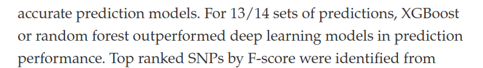
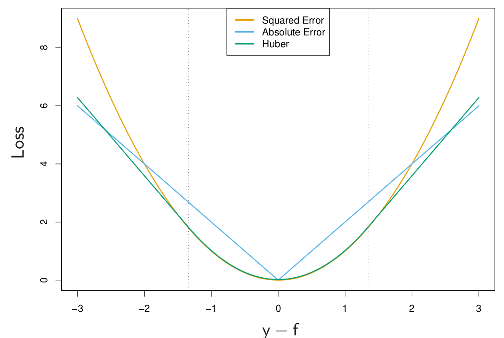

```{r setup, include=FALSE}
showsol<-TRUE
library(knitr)
opts_chunk$set(tidy.opts=list(width.cutoff=68),tidy=TRUE)
knitr::opts_chunk$set(echo = TRUE,tidy=TRUE,message=FALSE,warning=FALSE,strip.white=TRUE,prompt=FALSE,
                      cache=TRUE, size="scriptsize")
whichformat="latex"
```


---

## Learning material for this module

$~$

* @ISL2: Section 8.2.3 (Boosting)

\vspace{2mm}

* @hastie_etal2009: The Elements of Statistical Learning, Chapter 10

\vspace{2mm}

Check out: 

* https://arogozhnikov.github.io/2016/04/28/demonstrations-for-ml-courses.html

* https://bradleyboehmke.github.io/HOML/gbm.html
 
---

## What will you learn? (todo: update)

$~$

* Boosting methods -- general terms

\vspace{2mm}

* Boosting of linear models

\vspace{2mm}

* AdaBoost

\vspace{2mm}

* Gradient boosting

\vspace{2mm}

* XGBoost: eXtreme Gradient Boosting

\vspace{2mm}

* Maybe an outlook to modern methods: Light GBM, catboost, ngboost


---

## Boosting methods

$~$

* "Boosting" is one of the most powerful learning ideas that is currently around.

\vspace{2mm}

* First ideas in the 1990s and early 2000s (_e.g._, @freund1997decision, @ridgeway1999state, @friedman2000additive)

\vspace{2mm}

* Boosting is a general method for building an ensemble out of simpler models.

\vspace{2mm}

* Boosting is usually applied to models with high bias and low variance, usually in the context of boosted regression and classification trees.

\vspace{2mm}

* It is also possible to boost, e.g., linear or penalized regression models.


---


## Boosted trees vs deep learning (neural networks) 

$~$

* Boosted trees and neural networks (deep learning) are currently the most powerful competitors in statistical learning.

$~$


Mention some kaggle competitions here

---

## Examples (recent literature)

\centering

{width=70%}

$~$

\flushleft

From the abstract:

{width=80%}

---


See here to access the paper:

https://hal.science/hal-03723551v2


---
 
## Recap: Regression trees and random forests
 
 


---

## Motivation for Boosting in the context of trees

$~$


* Question: Could we address the shortcomings of single decision trees models in some other way than by using random forests?

$~$

* For example, rather than performing variance reduction on complex trees, can we decrease the bias of simple trees?

$~$

* A solution to this problem, making an good model from simple trees, is another class of ensemble methods called boosting.

$~$

_\textcolor{red}{Boosting}_ is the process of iteratively adding basis functions in a greedy fashion so that each additional basis function further reduces the selected loss function.

---

## Simple example 1: Boosting for a classification problem: AdaBoost
\tiny 
Chapter 10.1 in @hastie_etal2009, including Fig 10.1 and Algorithm 10.1

\normalsize

$~$

* Assume we have a binary classification problem for $Y\in \{-1,-1\}$, a vector of predictor variables $X$, and a classifier $G(X)$. 

\vspace{2mm}

* The error rate for a given training sample is then 
$$\text{err} =\frac{1}{N} \sum_{i=1}^N I(y_i \neq G(x_i)) \ .$$

\vspace{2mm}

* Here, $G(X)$ is assumed to be a _\textcolor{red}{weak classifier}_, that is, its error rate is only _slightly_ better than a random guess.

\vspace{2mm}


* $G(X)$ can for example be a tree which is only a "stump".

---


\vspace{2mm}

* How would such a weak classifier ever give good predictions?

\vspace{2mm}

* Idea: 
    * Sequentially apply the weak classifier on _modified versions_ of the data, producing a _sequence_ $G_m(x)$ of weak classifiers for $m=1,2,\ldots,M$. 
    * At the end, use a weighted sum $G(x)=\text{sign}\left( \sum_{m=1}^M \alpha_m G_m(x)\right)$ to make the final prediction.

\vspace{2mm}

* How do we then find the sequence $G_m(x)$?

---


\centering
{width=80%}

\small
(Taken from @hastie_etal2009 )

---

**Algorithm 10.1 (@hastie_etal2009): AdaBosot.M1**

$~$

1. Initialize the observation weights $w_i= 1/N$, $i=1,2,\ldots, N$

\vspace{2mm}

2. For $m=1,2,...,M$:  
    a) Fit a classifier $G_m(x)$ to the training data using weights $w_i$.
    b) Compute
    $$\text{err}_m = \frac{\sum_{i=1}^N w_i I(y_i\neq G_m(x_i))}{\sum_{i=1}^N w_i} \ .$$
    c) Compute $\alpha_m = \log((1-\text{err}_m)/\text{err}_m)$.
    d) Set $w_i \leftarrow w_i \cdot \exp(\alpha_m \cdot I(y_i\neq G_m(x_i)),$ $i=1,2,\ldots, N$.

\vspace{2mm}

3. Output $G(x) = \text{sign}\left[\sum_{m=1}^M \alpha_m G_m(x)\right]$.  


---

Explanations:  

$~$
 
 * Weights $\alpha_m$: assigns larger overall weight to good classifiers.
 
 * Weights $w_i$ modify the original data. This ensures that observations $i$ with wrong classification in $G_{m-1}(x)$ obtain larger weights, namely 
 \begin{align*} 
 w_i &\leftarrow w_i \cdot \exp(\alpha_m) \ , &\text{ if } y_i \neq G(x_i) \ , \\
 w_i &\leftarrow w_i \ , &\text{ if } y_i = G(x_i) \ .
 \end{align*}
 
 * The sum $\sum_{m=1}^M \alpha_m G_m(x)$ is a continuous number, so we take its sign to get a classification into -1 or 1. 
 
---

## Example

$~$

Inspired by (10.2) in the Elements book:

* Generate features $X_1, \ldots, X_{10}$ multivariate Gaussian.
* Classify $y=1$ if $\sum_{j=1}^{10}X_j^2 > 9.34$, $y=-1$ otherwise.
* 1000 traning and 4000 test observations.

$~$

Yields roughly half/half of each category:

$~$

\scriptsize
\centering
```{r,echo=TRUE,fig.width=6,fig.height=5,out.width="40%"}
library(mvtnorm)
set.seed(123)
X <- rmvnorm(5000,rep(0,10))
y <- ifelse(rowSums(X^2)>9.34,1,-1)
hist(y,title="")
```

---

Fit AdaBoost on the training data using the function `ada()` from the `ada` R package. We use default choice for tree depth:

$~$

\centering

\scriptsize
```{r,echo=TRUE,fig.width=6,fig.height=5,out.width="60%"}
library(ada)
dd <- data.frame(X,y)
dd.train <- dd[1:1000,]
dd.test <- dd[1001:5000,]
r.ada <- ada(y~.,dd.train,iter=400,type="discrete", control=rpart.control())
plot(r.ada)
```

 


---

### Error rates: AdaBoost vs random forest

$~$

AdaBoost test error: 

\vspace{2mm}

\scriptsize
```{r}
ada.pred <- predict(r.ada,dd.test)
sum(dd.test$y!=ada.pred)/4000
```

$~$

$~$

\normalsize
Random forest test error:

\vspace{2mm}

\scriptsize
```{r}
library(randomForest)
set.seed(123)
rf.boston=randomForest(as.factor(y)~.,dd.train,mtry=3,
                       ntree=1000)
rf.pred <- predict(rf.boston,newdata=dd.test)
sum(dd.test$y!=rf.pred)/4000
```

---

# Simple example 2: Boosting regression trees 

<!-- _Boosting_ is an alternative approach for improving the predictions resulting from a decision tree.  -->
<!-- We will only consider the description of boosting regression trees (and not classification trees) in this course. -->

$~$

In tree boosting, trees are grown _sequentially_ so that each tree is grown using information from the previous tree. 

1. Build a decision tree with $d$ splits (and $d+1$ terminal notes).
2. Improve the model in areas where the model didn't perform well. This is done by fitting a decision tree to the _residuals of the model_. This procedure is called _learning slowly_. 
3. The first decision tree is then updated based on the residual tree, but with a weight. 

The procedure is repeated until some stopping criterion is reached. Each of the trees can be very small, with just a few terminal nodes (or just one split).

---

**Algorithm 8.2: Boosting for regression trees**

1. Set $\hat{f}(x) = 0$ and $r_i = y_i$ for all $i$ in the training set.
2. For $b=1,2,...,B$, repeat:  
    a) Fit a tree $\hat{f}^b$ with $d$ splits ($d+1$ terminal nodes) to the training data.  
    b) Update $\hat{f}$ by adding in a shrunken version of the new tree: $$\hat{f}(x) \leftarrow \hat{f}(x)+\lambda \hat{f}^b(x).$$  
    c) Update the residuals, $$r_i \leftarrow r_i - \lambda \hat{f}^b(x_i).$$  
3. The boosted model is $\hat{f}(x) = \sum_{b=1}^B \lambda \hat{f}^b(x).$

Boosting has three tuning parameters which need to be set ($B$, $\lambda$, $d$), and can be found using cross-validation.

---

**Tuning parameters**

* **Number of trees $B$**. Could be chosen using cross-validation. A too small value of $B$ would imply that much information is unused (remember that boosting is a slow learner), whereas a too large value of $B$ may lead to overfitting. 

* **Shrinkage parameter $\lambda$**. Controls the rate at which boosting learns. $\lambda$ scales the new information from the $b$-th tree, when added to the existing tree $\hat{f}$. Choosing a small value for $\lambda$ ensures that the algorithm learns slowly, but will require a larger $B$. Typical values of $\lambda$ is 0.1 or 0.01.

* **Interaction depth $d$**: The number of splits in each tree. This parameter controls the complexity of the boosted tree ensemble (the level of interaction between variables that we may estimate). By choosing $d=1$ a tree stump will be fitted at each step and this gives an additive model.


---

## Revisit the Boston data from module 8

$~$

We are now finally boosting the Boston trees! We use the `gbm()` function from the respective R package. We boost with 5000 trees and allow the interaction depth (number of splits per tree) to be of degree 4:

\vspace{2mm}

\scriptsize

```{r,echo=FALSE}
library(MASS)
set.seed(1)
train = sample(1:nrow(Boston), nrow(Boston)/2)
boston.test=Boston[-train,"medv"]
```

```{r}
library(gbm)
set.seed(1)
boost.boston=gbm(medv~.,data=Boston[train,],
                 distribution="gaussian",
                 n.trees=5000,interaction.depth=4)
summary(boost.boston,plotit=FALSE)
```

---
 
**Prediction on the test set**

* Calculate the MSE on the test set, first for the model with $\lambda=0.001$ (default), then with $\lambda=0.2$.

* Ideally, we should do a cross-validation to find the best $\lambda$ over a grid (comes later), but here it seems not to make a big difference.

$~$

\scriptsize

```{r}
yhat.boost=predict(boost.boston,newdata=Boston[-train,],n.trees=5000)
mean((yhat.boost-boston.test)^2)
```

\vspace{2mm}

```{r}
boost.boston=gbm(medv~.,data=Boston[train,],distribution="gaussian",
                 n.trees=5000,interaction.depth=4,shrinkage=0.2,verbose=F)
yhat.boost=predict(boost.boston,newdata=Boston[-train,],n.trees=5000)
mean((yhat.boost-boston.test)^2)
```


<!-- --- -->

<!-- \scriptsize -->

<!-- ```{r boston8, echo=TRUE, fig.width=5, fig.height=4,fig.align = "center",out.width='60%'} -->
<!-- plot(yhat.boost,boston.test,pch=20) -->
<!-- abline(0,1) -->
<!-- ``` -->


---

# Boosting more generally


$~$

* AdaBoost.M1 and the above regression tree example are both relatively simple special cases of (tree) boosting. 

\vspace{2mm}

* We therefore step a bit back and look at boosting methods in more generality.


---

## Boosting trees -- what do we want to minimize?

$~$ 

Start by looking again at _a single tree_. We need to find regions $R_j$ and values $f(x)=\gamma_j$ if $x\in R_j$, for $j=1,2,\ldots,J$. The tree can then be expressed as 

$$T(x;\Theta) = \sum_{j=1}^J \gamma_j I(x\in R_j) \ .$$
$~$

Formally we want to minimize

\begin{equation}\label{eq:treeopt}
\hat\Theta = \arg \min_\Theta \sum_{j=1}^J \sum_{x_i \in R_j} L(y_i,\gamma_i) \ , 
\end{equation}
for a set of observations $(x_i,y_i)$ $(i=1,\ldots,N)$ and for loss function $L()$, for example squared-error, Gini, deviance loss etc. 

---

\label{sl:regions}

The optimization problem is split into two parts:

$~$

1) **Find $\gamma_j$ given $R_j$**: Given $R_j$, estimating $\gamma_j$ is easy. Either $\gamma_j=\overline{y_j}$ or majority vote for classification.

\vspace{2mm}

2) **Finding the regions $R_j$**: This is the hard part. Usually approximative via greeding algorithm. Often, use smoother approximations of the optimization criterion 
\begin{equation}\label{eq:approx}
\tilde\Theta = \arg \min_\Theta \sum_{j=1}^J \sum_{x_i \in R_j} \tilde{L}(y_i,T(x_i,\Theta)) \ , 
\end{equation}
and then use $\hat{R}_j=\tilde{R}_j$ to find $\gamma_j$ using the original criterion \eqref{eq:treeopt}.


---

## From single trees to boosting

$~$

* The result of boosting is a sum of $M$ trees
$$f_M(x) = \sum_{m=1}^M T(x;\Theta_m) \ .$$
\vspace{2mm}

* Tree boosting is about _how to find each tree_. 

\vspace{2mm}

* At each step, one must solve 
\begin{equation}\label{eq:boosted}
\hat\Theta_m = \arg \min_{\Theta_m} \sum_{i=1}^N L\left(y_i, f_{m-1}(x_i) + T(x_i;\Theta_m)\right) 
\end{equation} 
to find the next set $\Theta_m$, given $f_{m-1}(x)$.

---

$~$

* For a _\textcolor{red}{regression tree}_ with **squared-error loss**, solving \eqref{eq:boosted} is the same as for a single tree. Just sequentially fit regression trees to the residuals $r_i = y_i - f(x_i)$ from the previous tree. 

$~$

* For _\textcolor{red}{binary classification}_ and **exponential loss** 
$$L(y,f(x))=\exp(-yf(x)) \ ,$$ 
we get AdaBoost (Algorithm 10.1).

$~$

---

$~$

* Both strategies on the previous slide are straightforward, but _not very robust_. 

\vspace{2mm}

* We therefore look for general algorithms that can use any loss function $L(f)$ when $f$ is **contrained to be a sum of trees**. 

\vspace{2mm}

* It is then sometimes better to approximate the loss function as $\tilde{L}(f)$ in the tree-building step (see \eqref{eq:approx}) and use $L(f)$ only to determine the $\gamma_{jm}$ values in each tree $m$. 

$~$

**Main idea:** Iteratively build trees for the _gradient_ of the previous tree. Motivated by steepest descent.


---

## Steepest descent -- a numerical optimization technique

$~$

* _\textcolor{red}{Steepest descent}_ is a general numerical optimization technique.

\vspace{2mm}

* When trying to find the best function $f(x)$ that minimizes a loss function 
$$L(f) = \sum_{i=1}^N L(y_i,f(x_i)) \ ,$$
the direction of steepest descent is given by an $n$-dimensional vector with entries
$$g_{im} = \left[ \frac{\partial L(y_i,f(x_i))}{\partial f(x_i)} \right] \ ,$$
with gradient vector $\mathbf{g_m}^\top = (g_{1m},g_{2m},\ldots, g_{Nm})$.


---


* To update from $\mathbf{f}_{m-1}$ to $\mathbf{f}_m$\footnote{$\mathbf{f}_m = (f_m(x_1),f_m(x_2),\ldots, f_m(x_N))^\top$ }, we search for the largest decrease in the loss function as

$$\rho_m = \arg \min_\rho L(\mathbf{f}_{m-1} - \rho \mathbf{g}_m) \ , $$

$~$

* Then update $\mathbf{f}_m = \mathbf{f}_{m-1} - \rho_m \mathbf{g}_m$. 

$~$

\pause

* However, recall that we want to fit trees $f_m(x)=T(x;\Theta_m)=\sum_{j=1}^J \gamma_j I(x\in R_j)$, not aribtrary predictor functions $\mathbf{f}_m$. 


---

## Gradient Boosting: Steepest descent for trees

$~$

**The central idea**: find a tree $T(x;\Theta_m)$ that is as close as possible to the negative gradient 

\begin{equation}
\tilde{\Theta}_m= \arg \min_\Theta \sum_{i=1}^N (-g_{im} -T(x_i;\Theta))^2 \ .
\end{equation}

\vspace{8mm}

That is: Fit a tree $T$ to the negative gradient using least squares!

---

\vspace{2mm}

* This leads to regions $\tilde{R}_{jm}$ that are close (enough) to the optimal regions $R_{jm}$ from \eqref{eq:boosted}.  
\vspace{2mm}
$\rightarrow$ This corresponds to the step to find the regions $\hat{R}_{jm}=\tilde{R}_{jm}$ (step 2 on slide \ref{sl:regions}).


$~$


* Finally, find $\gamma_{jm}$ given the regions $\hat{R}_{jm}$.  
\vspace{2mm}
$\rightarrow$ This is the "easy" step 1 on slide \ref{sl:regions} and is done by
\begin{equation*}
\hat\gamma_{jm} = \arg \min_{\gamma} \sum_{x_i \in \hat{R}_{jm}} L(y_i, f_{m-1}(x_i) + \gamma) \ .
\end{equation*}

---


 
## Gradient tree boosting algorithm

$~$


**Algorithm 10.3** in @hastie_etal2009:

$~$

1. Initialize $f_0(x) = \arg \min_\gamma \sum_{i=1}^N L(y_i,\gamma)$.

 \vspace{1mm}

2. For $m=1$ to $M$:
  
    (a) For $i=1,2,\ldots, N$ compute
  $$r_{im} = - \left[ \frac{\partial L(y_i,f(x_i))}{\partial f(x_i)} \right] \ .$$
   (b) Fit a regression tree to the targets $r_{im}$, giving terminal regions $R_{jm}, j=1,2,\ldots , J_m$. 
   
   \vspace{1mm}
   
   (c) For $j=1,2,\ldots, J_m$ compute
    $$\gamma_{jm} = \arg \min_\gamma \sum_{x_i \in R_{jm}} L(y_i, f_{m-1}(x_i) + \gamma) \ .$$
     \vspace{1mm}
    
    (d) Update $f_m(x)=f_{m-1}(x) + \sum_{j=1}^{J_m} \gamma_{jm}I(x\in R_{jm})$.
  
 \vspace{1mm}
    
3. Output $\hat{f}(x)=f_M(x)$.
 
---

## Gradient tree boosting for regression 

$~$

$r_{im} = - \left[ \frac{\partial L(y_i,f(x_i))}{\partial f(x_i)} \right]$ are the components of the negative gradient. We call them _\textcolor{red}{generalized}_ or _\textcolor{red}{pseudo-residuals}_. Why?

\vspace{8mm}

* Look at the (scaeled) **quadratic loss function** $$L(y_i,f(x_i)) = \frac{1}{2} (y_i-f(x_i))^2.$$

\vspace{2mm}

* Then $-\partial L(y_i,f(x_i))/\partial f(x_i) = y_i - f(x_i)$, which is the residual.

\vspace{2mm}

* Gradient boosting is thus equivalent to reducing the quadratic loss function as fast as possible ("steepest descent"). 


---

## Gradient tree boosting for regression -- loss functions

$~$

* **Quadratic loss**: Previous slide. Not very robust -- a lot of weight on extreme observations.

\vspace{8mm}

Popular alternatives:

\vspace{2mm}

* **Absolute loss**: 
$$L(y,f(x)) = |y-f(x)| $$

\vspace{2mm}

* **Huber loss**: 
 $$L(y,f(x)) = \begin{cases}
   (y-f(x))^2 &  \text{ for }  |y-f(x)|\leq \delta \ ,\\
  2\delta |y-f(x)| -\delta^2 &  \text{ otherwise.} 
\end{cases}
$$

---



---

## Gradient tree boosting for binary classification 

$~$

 Replace the squared error loss by the _binomial deviance_

$$L(y,f(x)) = -I(y=1) \log(p(x)) - I(y=0) \log(1-p(x)) \ , $$
with $$p(x) = \frac{e^{f(x)}}{1+e^{f(x)}} \ .$$

$~$

Here, $f(x)$ is the (linear) predictor function encoding the tree ensemble, similar to logistic regression.

$~$


---

## Gradient tree boosting for classification into $K$ classes

$~$

Replace the squared error loss by the _\textcolor{red}{K-class multinomial deviance}_

\begin{align}
L(y,f(x)) &= -\sum_{k=1}^K I(y = k) \log (p_k(x)) \\ 
 & = -\sum_{k=1}^K I(y = k) f_k(x) + \log(\sum_{l=1}^K e^{f_l(x)})
 \end{align}

with class probabilities 
$$p_k(x) = \frac{e^{f_k(x)}}{\sum_{l=1}^K e^{f_l(x)}} \ , $$ 
and corresponding functions $f(x)$. 

---

$~$

* Plugging $p_k(x)$ into the multinomial deviance, we see that  
$$-g_{ikm} = \left[ \frac{\partial L(y_i, f_1(x_i),\ldots, f_K(x_i))}{\partial f_k(x_i)} \right]_{f_{m-1}(x_i)} = I(y_i =k) - p_k(x_i) \ .$$
$~$

* For $K$ classes, we must build $K$ trees in each iteration of step 2. in the boosting procedure!

\vspace{2mm}

* In step 3., we aggregate the class probabilities for each class $k$.


---

The three main ingredients of gradient boosting:

\vspace{2mm}

* _\textcolor{red}{Loss Function}_: The function we want to minimize. Its role is to estimate how good the model is at making predictions with the given data.  

* _\textcolor{red}{Weak Learner}_: A weak learner is one that classifies our data but does so poorly, perhaps no better than random guessing. In other words, it has a high error rate. These are typically decision trees (also called decision stumps, because they are less complicated than typical decision trees).

* _\textcolor{red}{Additive Model}_: This is the iterative and sequential approach of adding the trees (weak learners) one step at a time. After each iteration, we need to be closer to our final model, since each iteration should reduce the value of our loss function.


---

# Parameter tuning

$~$

* Tree size in each iteration

* Number of boosting iterations

---

## Finding the right tree depth in boosting

$~$

See 10.11 in the Elements book

---

## Other (more general) tuning considerations


---

## Stochastic GBMs
\scriptsize
See @boehmke_greenwell2020 

$~$
\normalsize

* Stochastic gradient boosting: chose a random subsample of the training data for each tree.

\vspace{2mm}

* Again, the idea is to _reduce variance_. 

$~$

There are a few variants of stochastic gradient boosting that can be used, all of which have additional hyperparameters:

\vspace{2mm}

  *   Subsample rows before creating each tree  
  
  \vspace{2mm}
  
  *   Subsample columns before creating each tree  
  
  \vspace{2mm}
  
  *   Subsample columns before considering each split in each tree  


---

# Interpretation of tree ensembles

$~$

* Single trees are easy to interpret.

\vspace{2mm}

* Tree ensembles or linear combinations of trees (like in boosting) sacrifice interpretability.

\vspace{2mm}

* In Module 8 we have heard about _relative importance of predictor variables_.

\vspace{2mm}

* Another way to gain interpretability back is via _\textcolor{red}{partial dependency plots}_. They show the effect of individual predictors, where the effect of the other predictor variables is integrated out (see @hastie_etal2009, Section 10.13.2).

---

### Partial dependency plots

$~$

Quick theory from Section 10.13.2

---

### Partial dependency plots for the Boston example

$~$

`rm` (number of rooms) and `lstat` (% of lower status population) are the most important predictors. 

\vspace{2mm}

\scriptsize

```{r boston7, echo=TRUE, fig.width=5, fig.height=3,fig.align = "center",out.width='40%'}
plot(boost.boston,i="rm",ylab="medv")
plot(boost.boston,i="lstat",ylab="medv")
```


---

# Most recent advances: LightBGM, CatBoost

From https://bradleyboehmke.github.io/HOML/gbm.html: 

* LightGBM (Ke et al. 2017) is a gradient boosting framework that focuses on leaf-wise tree growth versus the traditional level-wise tree growth. This means as a tree is grown deeper, it focuses on extending a single branch versus growing multiple branches 

* CatBoost (Dorogush, Ershov, and Gulin 2018) is another gradient boosting framework that focuses on using efficient methods for encoding categorical features during the gradient boosting process. 


Both frameworks are available in R.

---

# Can we use boosting for simple linear regression models?

Yes!

(ev mention this early, or then here at the end)


---

# References

\tiny
