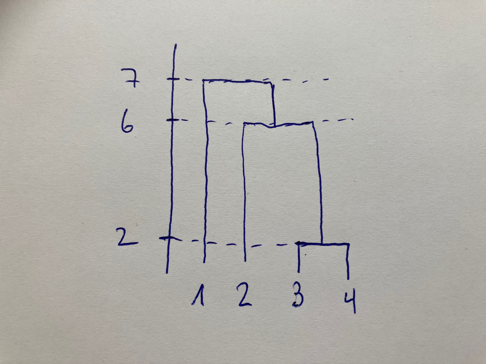

Check in the end which libraries we need:
```{r setup, include=FALSE}
library(knitr)
library(MASS)
library(caret)
library(pls)
library(glmnet)
library(gam)
library(gbm)
library(randomForest)
library(ggfortify)
library(leaps)
library(pROC)
library(tree)
library(class)

opts_chunk$set(tidy.opts=list(width.cutoff=68),tidy=TRUE)
knitr::opts_chunk$set(echo = TRUE,tidy=TRUE,message=FALSE,warning=FALSE,strip.white=TRUE,prompt=FALSE,
                      cache=FALSE, size="scriptsize", fig.height=4, fig.width=5,cache=TRUE)

```


###################################
# Problem 1 (Fill-in-the-blank text, 5P) 
###################################

0.5P per correct answer

Read the whole text and fill in the blanks such that the whole text makes sense (you might only understand which answer is correct after you continued reading):

In this course we learned about methods that can be used for statistical learning. 
We have mainly discussed supervised statistical learning methods, broadly divided into regression and classification problems. We were thereby discriminating between models that we use for prediction versus inference.

The methods and models in the course were broadly divided into supervised an unsupervised approaches. In our course we were mainly discussing supervised statistical learning methods, broadly divided into regression and _\textcolor{red}{classification}_ (prediction, inference, supervised, unsupervised,...) problems. In supervised learning, there are two main purposes:  _\textcolor{red}{inference}_ ( _prediction_, _variance reduction_, _unsupervised learning_, _non-parametric methods_, _over-fitting_) and _\textcolor{red}{prediction}_ ( _inference_, _bias reduction_, _variance reduction_, _supervised learning_, _model selection_, _bias-variance trade-off_). In both cases we want to learn from data and build a model that relates a set of variables to an outcome, but in the latter case we do not care about the actual model parameters, because we do not want to interpret them. 
When the goal is to interpret and understand causal effects, we prefer to use _\textcolor{red}{parametric}_ (non-parametric, flexible, classification, least squares) models. In a classification problem, for example, we then would prefer _\textcolor{red}{logistic regression}_ (hierarchical clustering, linear regression, boosted classification trees, neural networks, KNN classification, K-means clustering, local regression). 
 

An important topic that we were discussing throughout the course was the bias-variance trade-off. The main idea is that the _\textcolor{red}{reducible error}_ (training error, prediction bias, irredicuble error) is smallest for a model that balances bias and variance. With "variance" we here mean _\textcolor{red}{the variance of the estimated function}_ (the residual variance, the variance of the covariates, the variance of the response, the reducible error)

In the context of the bias-variance trade-off we were also discussing variable selection and methods based on shrinkage. Lasso and ridge regression were two shrinkage methods we learned about. Both Lasso and ridge regression are _\textcolor{red}{less flexible}_ (more flexible, more interpretable, less biased, easier to use) compared to least squares. Lasso tends to lead to _\textcolor{red}{more sparse models}_ (more accurate models, models with lower prediction error, better classification models, more flexible models) than ridge regression, thus Lasso is suitable for variable selection. In contrast to _\textcolor{red}{AIC minimization}_ (linear regression, ridge regression, the boostrap, boosted regression trees, neural networks), for example, Lasso does not suffer from model selection bias and should thus be preferred over other methods when the aim is to select a subset of variables.


###################################
# Problem 2 (Multiple choice and numeric answer, 8 P)
###################################


## a) (2P)  

In a study it was investigated how weight (kg) of adults changes with age (years) and sex (male=1, female=0). The result from the analysis is given in the following table:


Please select all statements that are true, according to the regression output:
  
  (i) Female weights increased on average by 0.11 kg/year.
  (ii) Males are on average 5.03 kg heavier than females.
  (iii) Male weights increased on average by 0.79 kg/year.
  (iv)  The dependency of weight on age appears to be different for males and females.

**Solution**
True - False - True - True  
Note that (ii) is false, because the coefficient is only valid as long as age=0.


## b) (2P)  
Please select all statements that are true about the reationship between Lasso and least squares:
  
  (i) Lasso is more flexible and hence will give improved prediction accuracy when its 
  increase in bias is less than its decrease in variance.
  (ii) Lasso is more flexible and hence will give improved prediction accuracy when its increase in variance is less than its decrease in bias.
  (iii) Lasso is less flexible and hence will give improved prediction accuracy when its increase in bias is less than its decrease in variance.
  (iv) Lasso is less flexible and hence will give improved prediction accuracy when its increase in variance is less than its decrease in bias.

**Solution**
False - False - True  - False

By using shrinkage, lasso can reduce the number of predictors so is less
flexible. As a result, it will lead to an increase in bias by approximating the
true relationship. We hope that this increase is small but that we dramatically
reduce variance (i.e. the difference we would see in the model fit between
different sets of training data).  
  


## c) (2P)

Suppose you build a neural network with:

  * 3 input variables
  * 1 hidden layer with 4 neurons
  * 1 output neuron

Assume also that all units are fully connected.

  (i)  How many weights (parameters) are there in total, including biases? 
  (ii) Suppose a hidden layer neuron has:
  
  - Input values: $x_1 = -1, x_2 = 2, x_3 = 0$
  - Weights: $w_1 = 0.5, w_2 = 0, w_3 = 1$
  - Bias: $b = 0$

    Assume a ReLU activation function. 
   Question: What is the output of the neuron?
  

**Solution**
 (i) [21]  Each hidden neuron has 3 input weights + 1 bias = 4 parameters. Total for hidden layer  $4\times 4 = 16$. Output neuron has 4 input weights (from hidden neurons) + 1 bias = 5 parameters.Final total = 16+5=2116+5=21.
 
 (ii)  [0] 
   Linear Combination: $-1\times 0.5  + 2 * 0 + 3 * 1 = -0.5$
   
   ReLU(-0.5) = 0


## d) (2P)  

This problem has to do with odds.
  
  (i) On average, what fraction of people with an odds of 0.37 of defaulting on their credit card payment will in fact default?
  (ii) Suppose that an individual has a 16% chance of defaulting on her credit card payment. What are the odds that she will default?

**Solution**

(i) 0.27
(ii) 0.19


## e) (2P)  

Please select all statements that are true.
  
In smoothing splines, increasing the smoothing parameter $\lambda$ will:

  (i) Make the fitted function more flexible and wiggly.
  (ii) Make the fitted function smoother and potentially underfit the data.
  (iii) Increase the penalty for wiggliness.
  (iv) Decrease the effective degrees of freedom.

**Solution**
FALSE, TRUE, TRUE, TRUE


## f) (3P)  
You perform PCA on a dataset with 5 **standardized** variables: $X_1,X_2,X_3,X_4,X_5$.

You obtain the following results:

Principal Component | Eigenvalue | Proportion of Variance Explained (PVE)
| -------- | ------- |------- |
PC1 | 2.7 | 0.54
PC2 | 1.5 | 0.30
PC3 | 0.5 | 0.10
PC4 | 0.2 | 0.04
PC5 | 0.1 | 0.02

You also know the loadings for the first principal component (PC1):
$$
\text{PC1}=0.85X_1+0.2X_2+0.2X_3+0.1X_4+0.05X_5
$$
$$\left(\begin{matrix} 0.85 \\0.2\\0.2\\0.1\\0.05 \end{matrix}\right)$$

You have an observation with the following standardized variable values:
$$
X_1=1,\ X_2=0.5,\ X_3=-0.5,\ X_4=-1,\ X_5=0
$$

**Questions**

   1. What proportion of the total variance is explained by the first four principal components combined? [0.96]
   
   2.  If you want to retain at least 90% of the total variance, how many principal components do you have to keep? [3]
   
   3.  Calculate the value of PC1 for the observation above, using the given loadings and standardized values. [0.75]
   
   4. If you plotted the observations using only PC1 and PC2, what percentage of the original dataset’s variability would be represented in the plot? [84]
   
   5. Which variable contribute most strongly to PC1, based on the loadings? [1] 
   
   6. What is the total variance in the original data? [5. since the variable are standardized the total variance is the sum of the eigenvalues] 

## g) (1P)

Why are nonlinear activation functions necessary in a neural network? (Please select all statements that are true )

  (i) To make training faster
  (ii) To allow the network to approximate complex, non-linear functions
  (iii) To reduce the number of parameters
  (iv) To make the network fully connected

**Solution**
FALSE, TRUE, FALSE, FALSE
   
###################################
# Problem 3 (Theory, 4P)
###################################

## a) (2P)

Assume that you have a dataset with $n = 100$ observations. Each observation contains a quantitative response $Y$ and one continuous predictor $X$. You then fit the following regression models:

   - Model a) $Y = \beta_0 + \beta_1 X + \epsilon$
   - Model b) $Y = \beta_0 + \beta_1 X + \beta_2 X^2 + \beta_3 X^2 + \epsilon$
   
  (i) Suppose that the true relationship between $X$ and $Y$ is linear, that is, Model a) is correct. Consider the _training residual sum of squares_ (RSS) for both models. Would we expect one to be lower than the other, would we expect them to be the same, or is there not enough information to tell? Justify your answer.
  (ii) Consider now the _test residual sum of squares_ (RSS). How would you answer to the previous question?
  
**Solution**  
(i) we would expect the Model b) to have lower training RSS since it is at least
as flexible as the linear regression.
(ii) Though we could not be certain, the test RSS would likely be higher due to
overfitting.

## b) (2P)
We have four observations for which we know the distance matrix in Euclidean space:

$$\left[ 
\begin{matrix}
0 & 6.5 & 5  & 7 \\
6.5 & 0 & 6 & 4 \\
5 & 6 & 0 & 2\\
7 & 4 & 2 & 0\\
\end{matrix} \right] \ .$$

Based on this dissimilarity matrix, sketch the dendogram that results from hierarchical clustering using complete linkage. On the plot, indicate the height where each fusion occurs, as well as the observastions that correspond to the leafs in the dendogram (enumerated as 1, 2, 3, 4). 

**Solution**

Complete linkage means that the maximal intercluster dissimilarity between all pairs in a cluster are used. The result therefore looks as follows:

{width=30%}

-1P is deducted for each mistake (including errors on the y-axis, or when the axis is missing).


###################################
# Problem 4 -- Data analysis 1 (16P)
###################################

Here we will use the Boston dataset where variables related to median house values (`medv`, in 1000\$) in the US are stored. We load and prepare the dataset as follows (copy the code into your Rmd file). Note that we only use 9 covariates and the response, and we convert `rad` (the index of accessibility to radial highways) into a factor variable:

```{r}
library(MASS)
data(Boston)

d.boston <- Boston[,c("crim","indus","chas","rm","age","dis","rad","tax","black","medv")]
d.boston$rad <- as.factor(d.boston$rad)
```

```{r, echo=TRUE, eval=FALSE}
# Look at and familiarise yourself with the data, for example using the pairs plot and checking its structure, for example using:
?Boston
pairs(d.boston)
str(d.boston)
summary(d.boston)
```
## a) (5P)
We start with a model for inference, that is, we want to understand the relationship between the variables in our dataset and the house value (`medv`). 

(i) (1P) Fit a linear regression model on the dataset `d.boston`, with `medv` as the response variable. Use all predictors linearly plus a quadratic term for the number of rooms `rm` by adding it as `I(rm^2)`.
(ii) (1P) How many degrees of freedom does the model consume?
(iii) (2P) Based on the results from (i), report the effect of having a house that bounds the Charles River (`chas` variable, use `?Boston` to find out what the variable means). How much more/less does an average property cost when it faces the river? Quantify both the effect size and its 95\% confidence interval.
(iv) (1P) Is there evidence that `rad` is a relevant variable in the model? Calculate and report the $p$-value that corresponds to an appropriate test, and interpret the result.

**Solution**
(i)

```{r}
formula <- medv~ . + I(rm^2)
r.boston<-lm(formula, data=d.boston)
summary(r.boston)
```
(ii) The degrees of freedom is the number of regression parameters, including the intercept. Here, they are 18.

(iii) A property on the river has, on average, a value that is $3.36\cdot 1000$ \$ higher. The 95\% CI is from `r round(confint(r.boston)['chas',],2)[1]` to `r round(confint(r.boston)['chas',],2)[2]` times 1000 dollars. (1P for the correct effect size and 1P for the correct CI).

(iv) Since we have to test whether all the 8 slope variables (for all the 8 dummy variables) are =0, we need an $F$-test, which we do via the anova function:
```{r}
anova(r.boston)
```
The $p$-value for the categorical `rad` variable is about 0.001, so there is strong evidence that the variable is associated with the response.

## b) (2P)
Now we change gears and try to find a model that is good in predicting the value of a new house. To this end, we split the data into a training and a test set:
```{r}
set.seed(4268)
samples <- sample(1:506, 354, replace = F)
d.boston.train <- d.boston[samples, ]
d.boston.test <- d.boston[-samples, ]
```

We use the same model as in a). Fit a linear regression model on the training data and calculate the mean squared error for the test data. 

**Solution:**

```{r}
formula2 <- medv~ . +I(rm^2) 
r.boston2<-lm(formula2, data=d.boston.train)
summary(r.boston2)$coef
```

```{r}
(mse.lm = mean((d.boston.test$medv - predict(r.boston2,newdata=d.boston.test))^2))
```
 
 

## c) (4P)

 (i) (2P) Now use Lasso to do model selection and at the same time to find a (possibly simpler) model that (hopefully) is better at predicting than the linear model fitted in b). To this end, use the training data and choose the $\lambda$ with the minimal error in a 10-fold cross-validation. As above, include the quadratic term for `rm` (in the exam we mistakingly wrote `age`, but both would be graded as correct).
 **Requirement**: Use `set.seed(4268)` before running the cross-validation.
 
 (ii) (2P) Fit the Lasso-model with $\lambda_\text{min}$ selected in (i) to the training data, and calculate the MSE on the test data. Compare to the linear regression situation and interpret. 
 
 
**R-hints**:

```{r, eval = FALSE}
x.train <- model.matrix(medv ~ ..., data = d.boston.train)
y.train <- d.boston.train$...

x.test <- ...
y.test <- ...

# Lasso
cv.lasso <- cv.glmnet(x.train,  y.train, alpha = ...)
plot(cv.lasso)
cv.lasso$...
fit.lasso = glmnet(..., ... , alpha=..., lambda = ...)
```
 
  
 **Solution**:

(i) (1P) for the CV and 1P for finding the lambda.1se.
```{r}
x.train <- model.matrix(medv ~ . + I(rm^2), data = d.boston.train)[, -1]
y.train <- d.boston.train$medv
x.test = model.matrix(medv ~ . + I(rm^2), data = d.boston.test)[, -1]
y.test = d.boston.test$medv
```
```{r}
library(glmnet)
set.seed(4268)
cv.lasso <- cv.glmnet(x.train, y.train, alpha=1,nfolds=10)
# The plot is not required, but nice to have:
plot(cv.lasso)
cv.lasso$lambda.min
```

(ii)
```{r}
boston.lasso <- glmnet(x.train, y.train, alpha = 1, lambda = cv.lasso$lambda.min)

coef(boston.lasso)
```

```{r}
mse.lasso = mean((y.test - predict(boston.lasso, newx = x.test))^2)
mse.lasso
```
MSE does not get better than with simple linear regression. Also, none of the coefficients have become zero. Probably this is a situation where most coefficients are having an effect - that is probably also why they are in the dataset.


 

## d) (3P)

It is time to use a more advanced prediction method with lower MSE. We therefore turn to a tree-boosting method using the `gbm()` function from the `gbm` package in R.   

   (i) (1P) Use the same input variables as above (you may drop the quadratic term for `rm`) and fit the model on the training data. Choose reasonable parameters and explain all your choices carefully. 
   (ii) (1P) Predict on the test set and calculate the MSE. Interpret the result in comparison to what you found in a) and c).  
   (iii) (1P) Look at variable importances using the `summary()` function. 

**Solution:**
(i)
```{r}
library(gbm)
r.gbm  <- gbm(medv ~ . , data=d.boston.train,distribution="gaussian",n.trees=1000,interaction.depth=2,shrinkage=0.05)
```

Explanation of how n.trees, interaction.depth and shrinkage are chosen.

(ii)
```{r}
mean((d.boston.test$medv -predict(r.gbm,newdata=d.boston.test))^2)
```

Most will find that the test error has decreased, which could indicate that there are non-linearities involved in the association between the covariates and the response.

(iii)
```{r}
summary(r.gbm)
```

## e) (2P)

Finally, we are fitting a GAM using the R-code below:

```{r}
library(gam)
r.gam <- gam(medv ~ bs(rm,df=5) +  crim + dis + bs(age,knots=quantile(age,c(0.2,0.4,0.6,0.8))) + black + chas , data=d.boston.train)
```

(i) (1P) How many degrees of freedom does the spline for `age` in the model consume?
(ii) (1P) Fit the above model and calculate the MSE for the test dataset. Compare to the results from the other methods.

**Solution:**

(i) 7: 4 for the knots + 3 (K+3) without the intercept, because the intercept is already in the model, so it should not be counted here. If the answer was 8, we only deducted -0.5 P.
 
(ii) 
```{r}
mean((d.boston.test$medv -predict(r.gam,newdata=d.boston.test))^2)
```
So even though we do not use all the regression variables, we get a lower test error for the GAM compared to linear regression or the Lasso. However, the test error is a bit higher than for the boosted trees, making tree boosting the winner in this case.
 
 
###################################
# Problem 5 -- Data analysis 1 (17 P)
###################################

We will look at a classification problem using the data set \texttt{default.csv} that you can find here.

Download the .Rmd and the data in the same folder.

The dataset contains 30000 records of a bank's costumemers default payment. In addition to the response variable \texttt{DEFAULT} with values 0/1 (No deafult/Default), the dataset contains 22 features defined as follows:

 - `LIMIT_BAL`: Amount of the given credit (in 1000 dollar). It includes both the individual consumer credit and his/her family (supplementary) credit.
 
 - `SEX`: Gender (1 = male; 2 = female).
 
 - `EDUCATION`: Education (1 = graduate school; 2 = university; 3 = high school; 4 = others).
 
 - `MARRIAGE`: Marital status (1 = married; 2 = single; 3 = others).
 
 - `AGE`: Age (year).
 
 - `PAY_0` - `PAY_6`: History of past payment. Monthly payment status  from April to September 2005. The measurement scale for the repayment status is: 0 = pay duly; 1 = payment delay for one month; 2 = payment delay for two months; . . .; 8 = payment delay for eight months; 9 = payment delay for nine months and above.
 
 - `BILL_AMT1`-`BILL_AMT6`: Amount of bill statement (in 1000 dollar) from April to September 2005.
 
 - `PAY_AMT1`-`PAY_AMT6`: Amount of previous payment (in 1000 dollar) from April to September 2005.

Note that `SEX` and `EDUCATION` are discrete variable and we define them as factors. You can use the following code the read the data:

```{r}
default = read.table("default.csv")
default$MARRIAGE = as.factor(default$MARRIAGE)
default$SEX = as.factor(default$SEX)
```

Before starting, it is smart to investigate the data a little bit, for example by making pairs `plots` or looking at the structure using `str(data)` etc.

We are interested in predicting whether clients default or not.

## a) (7P)

  (i) (1P) Fit a logistic regression model on the full data set with `DEFAULT` as response variable. Use all the covariates and include the interaction between `SEX` and `PAY_0`
  (ii) (2P) Look at the output from (i). How does the feature `PAY_0` influences the odds to default?
  (iii) (2P) Explain what  sensitivity and specificity are for this specific problem. Then compute them using as threshold value for the  predicted probability $p=0.5$. 
  (iv) (2P) Figure \ref{fig:figs} shows the ROC curve for the model in point (i). Explain what the ROC curve illustrates, in particular explain what the two axes of the plot represent. 

```{r figs, echo=FALSE, fig.width=3,fig.height=3,fig.cap="\\label{fig:figs}ROC curve"}
mod.glm = glm(DEFAULT~ . + SEX:PAY_0, data = default, family = "binomial")

preds = predict(mod.glm, newdata = default, type = "response")
tresh = seq(0,1,0.01)
sens = numeric(length(tresh))
spec = numeric(length(tresh))
for(i in 1:length(tresh))
{
  pred = as.numeric(preds>tresh[i])
  sens[i] = sum(pred==1 & default$DEFAULT==1)/sum(default$DEFAULT==1)
  spec[i] = sum(pred==0 & default$DEFAULT==0)/sum(default$DEFAULT==0)
}
library(ggplot2)
ggplot(data = data.frame(a = 1-spec,
           b = sens)) + geom_line(aes(a,b)) +
  geom_abline(intercept = 0, slope = 1, linetype = "dotted") + xlab("") + ylab("")
```


**R-hints**:
```{r, eval = FALSE}
mod = glm(..., family = "binomial")
pred = predict(mod, ...)
```

  
**Solution**

(i)
```{r}
mod.glm = glm(DEFAULT~ . + SEX:PAY_0, data = default, family = "binomial")
summary(mod.glm)
```

(ii)

For males (the reference category) we have that 

```{r}
exp(coef(mod.glm)["PAY_0"])
```

Interpretation: For males, the odds for default increases by a factor of 2.217 for every additional month that the payment for April is delayed


For females (the reference category) we have that 

```{r}
exp(coef(mod.glm)["PAY_0"] + coef(mod.glm)["SEX2:PAY_0"])
```

Interpretation: For females, the odds for default increases by a factor of 2.57 for every additional month that the payment for April is delayed


(iii)


```{r}
preds = round(predict(mod.glm, newdata = default, type = "response"))
sensitivity = sum(preds==1 & default$DEFAULT==1)/sum(default$DEFAULT==1)
specificity = sum(preds==0 & default$DEFAULT==0)/sum(default$DEFAULT==0)
```

Sensitivity is the ability of a model to correctly identify clients that default. It can be computed as the fraction of true defaulters that are identified. In our case it is `r sensitivity`.

Specificity is the ability of a model to correctly identify clients that do not default. It can be computed as the fraction of true non-defaulters that are identified. In our case it is `r specificity`.


(iv)  The ROC curve  is a visual representation of model performance across all thresholds. 
The ROC curve is drawn by calculating the true positive rate (TPR) and false positive rate (FPR) at every possible threshold (in practice, at selected intervals), then plotting TPR (on the $y$ axes) over FPR (on the $y$ axes). The area under the curve (AUC)  can be used to summarize the overall performance of a classifier over all possible thresholds, the larger the AUC the better the classifier.

## b) (3P)


Split the data into a training and a test set as follows:
```{r}
set.seed(1234)
samples <- sample(1:dim(default)[1], 0.7 *  dim(default)[1], replace = F)
train <- default[samples, ]
test <- default[-samples, ]
```


  (i) (1P) Use  a $K$-Nearest Neighbors classifier (using $K = 35$) to predict default on the training set.
  (ii) (2P) Generate the confusion table and calculate the error rate, sensitivity and specificity for the prediction on the test set. Compute also the test error rate.

**R-hints**:
```{r, eval = FALSE}
pred.knn = knn(..., ..., ...)
```

  
**Solution**

  (i)

```{r}
pred.knn = knn(train[,-23], test[,-23], cl = (train$DEFAULT), k = i, l = 0)
```

  (ii)
  
```{r}
confusionKNN = table(true=test$DEFAULT, predict=pred.knn)
confusionKNN

sensKNN = confusionKNN[2, 2]/(sum(confusionKNN[2,]))
spesKNN = confusionKNN[1, 1]/(sum(confusionKNN[1,])) 
c(sensitivity = sensKNN, specificity = spesKNN)

test.errorKNN = mean(test$DEFAULT != pred.knn)
c(test_error= test.errorKNN)
```
## c) (4P)

 (i) (3P) Now, choose a tree-based method and fit it using the training data, then predict the response using the test data and compute sensitivity, specificity and error rate. Justify the choice of any parameters you use.
(ii) (1P) Based on the model you chose in (i), which three variables are most important to predict default, according to an importance measure based on node purity?

**Solution**

 (i) Different solutions are possible, here we describe a random forest. 
 

```{r, cache = T}

mod.rf = randomForest(as.factor(DEFAULT) ~ ., data = train, mtry = 5, ntree = 500,
    importance = TRUE)

pred.rf <- predict(mod.rf, test, type = "class")
```
Here we have to choos `mtry`, which should be ca $\sqrt{p}$, with $p = 22$ (number of regression variables). So we can use 4, perhaps 5. The number of trees is not a tuning parameter, but the students should mention that it should be chosen “large enough”.

```{r}
confusionRF = table(true=test$DEFAULT, predict=pred.rf)
confusionRF

sensRF = confusionRF[2, 2]/(sum(confusionRF[2,]))
spesRF = confusionRF[1, 1]/(sum(confusionRF[1,])) 
c(sensitivity = sensRF, specificity = spesRF)

test.errorRF = mean(test$DEFAULT != pred.rf)
c(test_error= test.errorRF)

```

(ii)

```{r}
varImpPlot(mod.rf, type = 2)
```

The most important predictors are `PAY_0` and `BILL_AMT1`

## d) (3P)

  (i) (2P) Use the logistic regression model in a), fitted to the training to predict the DEFAULT in the test set. Compute sensitivity, specificity and error rate. Compare the models you have fitted, which one would you choose?
  (iii) (1P) Finally, look at the distribution of the DEFAULT variable, reflect on how this is related to the values of sensitivity, specificity and error rate you have computed.

**Solution**

  (i)
```{r}
mod.glm = glm(DEFAULT~ . + SEX:PAY_0, data = train, family = "binomial")

pred.log = round(predict(mod.glm, newdata = test, type = "response"))

confusionLOG = table(true=test$DEFAULT, predict=pred.log)
confusionLOG

sensLOG = confusionLOG[2, 2]/(sum(confusionLOG[2,]))
spesLOG = confusionLOG[1, 1]/(sum(confusionLOG[1,])) 
c(sensitivity = sensLOG, specificity = spesLOG)

test.errorLOG = mean(test$DEFAULT != pred.log)
c(test_error= test.errorLOG)
```

```{r}
data.frame(
  mod = c("logistic_reg", "KNN", "RF"),
  sens = c(sensLOG, sensKNN, sensRF),
  spec = c(spesLOG, spesKNN, spesRF),
  error = c(test.errorLOG, test.errorKNN, test.errorRF))


```
The RF model seems to have the best performance. It has the lowest error and the highest sensitivity.

  (ii)
  
 
```{r}
table(default$DEFAULT)/length(default$DEFAULT) * 100
```
The dataset is unbalanced with a lot more 0s (ca 78\%) than 1s (ca 22\%). In this case, the model learns to favor the majority class (0) because it can get high overall accuracy just by predicting 0 most of the time.
As a result, it correctly predicts 0 very often (high specificity) and it it misses the rare 1s (low sensitivity).
  
  
  
  
