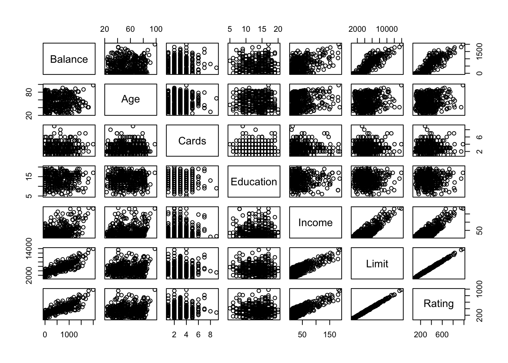

```{r setup, include=FALSE}
knitr::opts_chunk$set(echo = TRUE)
```

# 1

a. Show that the least square estimator of a multiple linear regression model is given by
$$
\hat{\boldsymbol \beta} =(\boldsymbol X^T \boldsymbol X)^{-1} \boldsymbol X^T \boldsymbol Y
$$
b. Show that the maximum likelihood estimator is equal to the least square estimator for the multiple linear regression model.

# 2

Write `R` code to create a similar representation of the `Credit` data set in the `ISLR`-package, as in the figure shown below.

{width=50%}

# 3

a. For the Credit dataset, pick the best model using Best Subset Selection according to $C_p$, $BIC$ and Adjusted $R^2$
    + Hint: Use the `regsubsets()` of the `leaps` library, similar to what was done in Lab 1 of the book.
b. For the Credit dataset, pick the best model using Best Subset Selection according to a $10$-fold CV
    + Hint: Use the output obtained in the previous step and build your own CV function to pick the best model.
c. Compare the result obtained in Step 1 and Step 2.

# 4

a. Select the best model for the Credit Data using Forward, Backward and Hybrid (sequential replacement) Stepwise Selection.
    + Hint: Use the `regsubsets()` of the `leaps` library
b. Compare with the results obtained with Best Subset Selection.

# 5

a. Apply Ridge regression to the Credit dataset.
b. Compare the results with the standard linear regression.

# 6

a. Apply Lasso regression to the Credit dataset.
b. Compare the results with the standard linear regression and the Ridge regression.

# 7

How many principal components should we use for the Credit dataset? Justify. 

# 8

Apply PCR on the Credit dataset and compare the results with the previous methods used in this module.

# 9

Apply PLS on the Credit dataset and compare the results with the previous methods used in this module.


